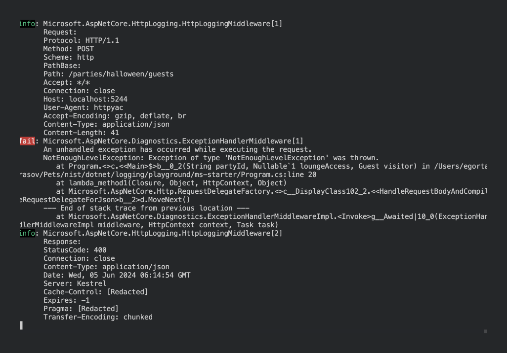
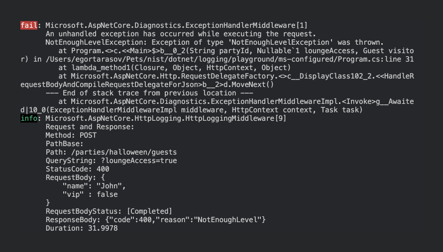

# Request-Response Logging in ASP .NET Core

Since .NET 6


## First take: Minimal Setup

### Our simple app

```csharp
app.MapPost("/parties/{partyId}/guests", (string partyId, [FromQuery] bool? loungeAccess, Guest visitor) => {
    if (loungeAccess == true && !visitor.Vip) 
        throw new NotEnoughLevelException();

    return new Ticket(
        PartyId: partyId,
        Receiver: visitor.Name,
        LoungeAccess: loungeAccess ?? false,
        Code: Guid.NewGuid().ToString()
    );
});

app.Run();

public record Guest(string Name, bool Vip);
public record Ticket(string PartyId, string Receiver, bool LoungeAccess, string Code);
public class NotEnoughLevelException : Exception;
```

### Set up error handling

```shell
dotnet add package Nist.Errors
```

```csharp
// ...

app.UseErrorBody<Error>(ex => ex switch {
    NotEnoughLevelException _ => new (HttpStatusCode.BadRequest, "NotEnoughLevel"),
    _ => new (HttpStatusCode.InternalServerError, "Unknown")
}, showException: false);

// ... app.MapPost
```

### The logging itself

```csharp
// ...
builder.Services.AddHttpLogging(o => {});

// ....
// var app = builder.Builder()
// ...

app.UseHttpLogging();

// ...app.UseErrorBody
```

1. Remove `appsettings.Development.json` since it's redundant for our scenario.
2. Since by default log level is `Microsoft.AspNetCore` is 

```json
"Microsoft.AspNetCore.HttpLogging.HttpLoggingMiddleware": "Information"
```

### The complete file:

Here's the compelete `Program.cs`

```csharp
using Microsoft.AspNetCore.Mvc;
using Nist.Errors;
using System.Net;

var builder = WebApplication.CreateBuilder(args);

builder.Services.AddHttpLogging(o => {});

var app = builder.Build();

app.UseHttpLogging();

app.UseErrorBody<Error>(ex => ex switch {
    NotEnoughLevelException _ => new (HttpStatusCode.BadRequest, "NotEnoughLevel"),
    _ => new (HttpStatusCode.InternalServerError, "Unknown")
}, showException: false);

app.MapPost("/parties/{partyId}/guests", (string partyId, [FromQuery] bool? loungeAccess, Guest visitor) => {
    if (loungeAccess == true && !visitor.Vip) 
        throw new NotEnoughLevelException();

    return new Ticket(
        PartyId: partyId,
        Receiver: visitor.Name,
        LoungeAccess: loungeAccess ?? false,
        Code: Guid.NewGuid().ToString()
    );
});

app.Run();

public record Guest(string Name, bool Vip);
public record Ticket(string PartyId, string Receiver, bool LoungeAccess, string Code);
public class NotEnoughLevelException : Exception;
```

### Test it out

For successful request:

```http
POST http://localhost:5244/parties/new-year/guests?loungeAccess=true

{
    "name": "Paul",
    "vip" : true
}
```

We'll get this log:


And for a "bad" request

```http
POST http://localhost:5244/parties/halloween/guests?loungeAccess=true

{
    "name": "John",
    "vip" : false
}
```

We'll get:



## Log It All

```csharp
builder.Services.AddHttpLogging(o => {
    o.CombineLogs = true;

    o.LoggingFields = HttpLoggingFields.All | HttpLoggingFields.RequestQuery;
});
```

And here's what we'll get now


## Cleaning things up

```csharp
builder.Services.AddHttpLogging(o => {
    o.CombineLogs = true;

    o.LoggingFields = HttpLoggingFields.RequestQuery
        | HttpLoggingFields.RequestMethod
        | HttpLoggingFields.RequestPath
        | HttpLoggingFields.RequestBody
        | HttpLoggingFields.ResponseStatusCode
        | HttpLoggingFields.ResponseBody
        | HttpLoggingFields.Duration;
});
```




## Making it better

```shell
dotnet add package Nist.Logging
```

```csharp
using Nist.Logs;
// remove builder.Services.AddHttpLogging
// ...

app.UseHttpIOLogging(); // instead of app.UseHttpLogging();
```


## Recap


```
| Feature            | Microsoft.AspNetCore.HttpLogging     | Nist.Logs |
|--------------------|--------------------------------------|-----------|
| Full Uri           | ❌ - Only Path and Query Separately   | ✅         |
| Minimalism         | ❌ - Few unremovable redundant fields | ✅         |
| Exception attached | ❌                                    | ✅         |
| Endpoint id        | ❌                                    | ✅         |
| Single Line        | ✅                                    | ✅         |
| Http Method        | ✅                                    | ✅         |
| Request Body       | ✅                                    | ✅         |
| Response Body      | ✅                                    | ✅         |
| Response Code      | ✅                                    | ✅         |
| Request Duration   | ✅                                    | ✅         |
```

And here's the final version of the `Program.cs`

```csharp
using Microsoft.AspNetCore.Mvc;
using Nist.Logs;
using Nist.Errors;
using System.Net;

var builder = WebApplication.CreateBuilder(args);

var app = builder.Build();

app.UseHttpIOLogging();

app.UseErrorBody<Error>(ex => ex switch {
    NotEnoughLevelException _ => new (HttpStatusCode.BadRequest, "NotEnoughLevel"),
    _ => new (HttpStatusCode.InternalServerError, "Unknown")
}, showException: false);

app.MapPost("/parties/{partyId}/guests", (string partyId, [FromQuery] bool? loungeAccess, Guest visitor) => {
    if (loungeAccess == true && !visitor.Vip) 
        throw new NotEnoughLevelException();

    return new Ticket(
        PartyId: partyId,
        Receiver: visitor.Name,
        LoungeAccess: loungeAccess ?? false,
        Code: Guid.NewGuid().ToString()
    );
});

app.Run();

public record Guest(string Name, bool Vip);
public record Ticket(string PartyId, string Receiver, bool LoungeAccess, string Code);
public class NotEnoughLevelException : Exception;
```