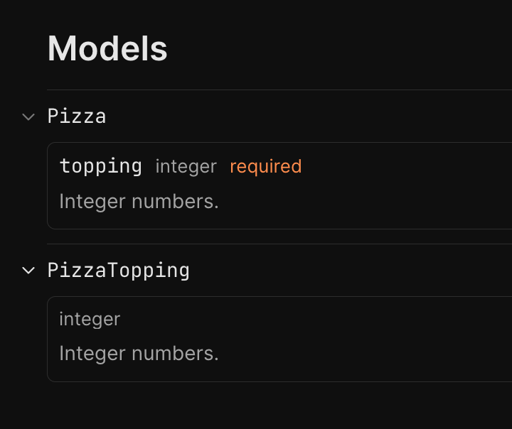
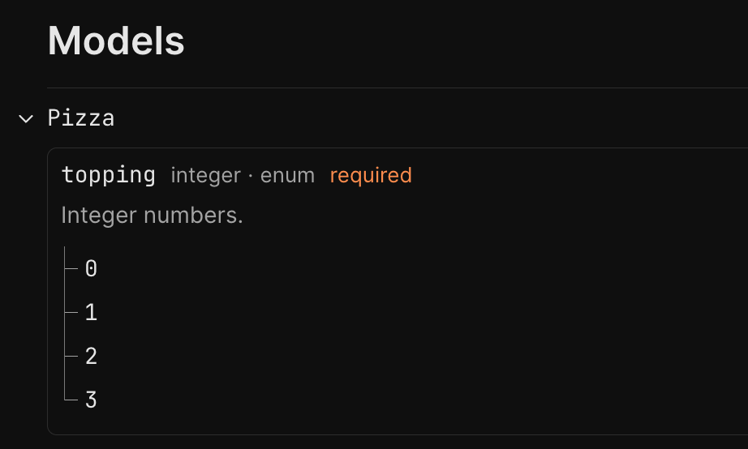
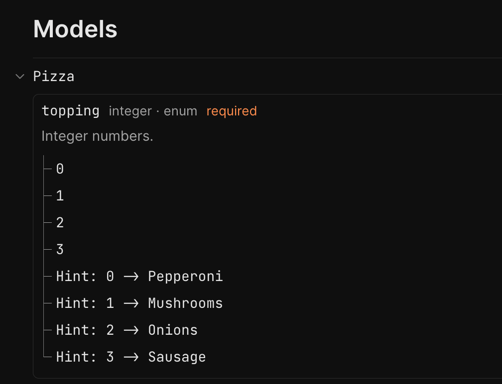
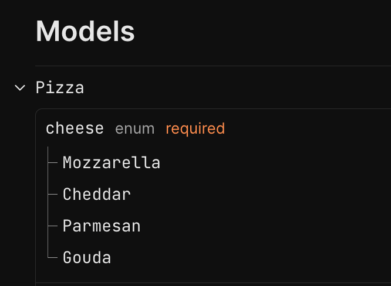

# Enums in OpenApi (Swagger) in .NET 9

> Using OpenApiSchemaTransformer to Customize Various Enum Representations.


Enums in APIs are surprisingly tricky. There are multiple approaches to representing enums, each problematic in its own way. In this article, we are going to take a look at different ways of representing enums in .NET. For each approach, we will take a look at what we will get in terms of OpenAPI and even improve a few representations.

## Getting Started: Integer Enums

In [this article](https://medium.com/@vosarat1995/making-your-openapi-swagger-docs-ui-awesome-in-net-9-67fbde6b71b5), I've explained how to set up OpenAPI UI with Scalar - we'll start from there. Let's create our API model with a simple enum just to get started:

```csharp
public enum PizzaTopping
{
    Pepperoni,
    Mushrooms,
    Onions,
    Sausage
}

public class Pizza
{
    public required PizzaTopping Topping { get; init; }
}
```

Of course, we'll also need endpoints to get a proper Swagger UI:

```csharp
app.MapGet("/", () => new Pizza {
    Topping = PizzaTopping.Onions
});

app.MapPost("/", (Pizza pizza) =>
{
    return pizza;
});
```

With that setup, if we open our Swagger UI we'll get the following models:



You might see the problem with the default view. There is absolutely no information about what values are supposed to be passed to `PizzaTopping`. Let's fix that in the next section.

## First Schema Transformer: Enum Numbers Info

OpenAPI models accept an enum property. However, they are not filled by default. Gladly, Microsoft's OpenAPI system allows us to arbitrarily transform the schema using `SchemaTransformer`. Let's add an extension method filling the `enum` property for an encountered enum object property:

```csharp
public static class OpenApiEnumExtensions
{
    public static OpenApiOptions AddEnumSchemaTransformer(this OpenApiOptions options)
    {
        options.AddSchemaTransformer((schema, context, cancellationToken) =>
        {
            if (context.JsonPropertyInfo?.PropertyType?.IsEnum != true) return Task.CompletedTask;
            if (schema.Enum?.Any() == true) return Task.CompletedTask;

            var values = Enum.GetValues(context.JsonPropertyInfo.PropertyType).Cast<Enum>();

            schema.Enum = [
                .. values.Select(v => new OpenApiInteger((int)(object)v)),
            ];

            return Task.CompletedTask;
        });

        return options;
    }
}
```

Here's how we can register the transformer:

```csharp
builder.Services.AddOpenApi(options =>
{
    options.AddEnumSchemaTransformer();
});
```

Here's what we'll get now:



Now, we know which options are available. However, we still have no idea what those options mean. Let's add and use an optional flag `includeInformationalStrings` in our `AddEnumSchemaTransformer` method:

```csharp
.. includeInformationalStrings
    ? values.Select(value => new OpenApiString($"Hint: {(int)(object)value} -> {value}"))
    : []
```

With the flag set to `true` by default, we should now see the following:



This pretty much covers default int-based representation of enums. However, there is a different way to represent enums, which is actually dominant for most popular public APIs - strings. Let's investigate it! 

## Standard Representation: JsonStringEnumConverter

```csharp
[JsonConverter(typeof(JsonStringEnumConverter))]
public enum PizzaCheeseType
{
    Mozzarella,
    Cheddar,
    Parmesan,
    Gouda
}
```

```csharp
public class Pizza
{
    public required PizzaTopping Topping { get; init; }
    public required PizzaCheeseType Cheese { get; init; }
}
```



```http
POST /

{
    "topping" : 11,
    "cheese" : "Cheddar"
}
```

The request will be processed as if it is an existing enum value.

```http
POST /

{
    "topping" : 3,
    "cheese" : "Maasdam"
}
```

```text
The JSON value could not be converted to PizzaCheeseType
```

## Making It Forward-Compatible: IStringEnum

```csharp
public class CrustTypes
{
    public const string Thin = "Thin";
    public const string Thick = "Thick";
    public const string Stuffed = "Stuffed";

    public static string[] All => [Thin, Thick, Stuffed];
}
```

```csharp
public class Pizza
{
    public required string Crust { get; init; }
}
```

```csharp
public interface IStringEnum
{
    public static abstract string[] All { get; }
}

public class StringEnumAttribute<ConstEnumType> : Attribute where ConstEnumType : IStringEnum
{
    public Type Type => typeof(ConstEnumType);
}
```

```csharp
public static class ReflectionHelper
{
    public static IEnumerable<Type> FinalImplementationsOf(this IEnumerable<Assembly> assemblies, Type interfaceType) =>
        assemblies.SelectMany(assembly => assembly
            .GetExportedTypes()
            .Where(t => interfaceType.IsAssignableFrom(t) && !t.IsInterface && !t.IsAbstract)
        );

    public static T CallStaticProperty<T>(this Type type, string propertyName) where T : class
    {
        var propertyInfo = type.GetProperty(propertyName, BindingFlags.Public | BindingFlags.Static)
            ?? throw new InvalidOperationException($"Type `{type.FullName}` does not have a static property named `{propertyName}`.");
            
        return propertyInfo.GetValue(null) as T ?? throw new InvalidOperationException($"Type `{type.FullName}` property `{propertyName}` is not of type `{typeof(T).FullName}`.");
    }
}
```

```csharp
public static Dictionary<Type, string[]> GetAllLoadedStringEnumTypes()
{
    var dict = new Dictionary<Type, string[]>();
    var assemblies = AppDomain.CurrentDomain.GetAssemblies();
    var stringEnumTypes = assemblies.FinalImplementationsOf(typeof(IStringEnum));

    return stringEnumTypes.ToDictionary(
        type => type,
        type => type.CallStaticProperty<string[]>(nameof(IStringEnum.All))
    );
}    
```


```csharp
class StubStringEnumForNameOf : IStringEnum { public static string[] All => []; }

public static Type? OptionalPropertyStringEnumType(this OpenApiSchemaTransformerContext context)
{
    var attr = context.JsonPropertyInfo?.AttributeProvider?.GetCustomAttributes(typeof(StringEnumAttribute<>), true)
        .FirstOrDefault();

    if (attr == null) return null;

    var type = attr.GetType().GetProperty(nameof(StringEnumAttribute<StubStringEnumForNameOf>.Type))!.GetValue(attr);
    return (Type?)type;
}
```

```csharp
public static OpenApiOptions AddStringEnumSchemaTransformer(this OpenApiOptions options)
{
    var typeValueDictionary = GetAllLoadedStringEnumTypes();

    options.AddSchemaTransformer((schema, context, cancellationToken) =>
    {
        var description = context.OptionalPropertyStringEnumType();
        if (description != null && typeValueDictionary.TryGetValue(description, out var constEnumValues))
        {
            schema.Enum = [.. constEnumValues.Select(v => new OpenApiString(v))];
        }

        return Task.CompletedTask;
    });

    return options;
}
```

```csharp
public class CrustTypes : IStringEnum
{
    public const string Thin = "Thin";
    public const string Thick = "Thick";
    public const string Stuffed = "Stuffed";

    public static string[] All => [Thin, Thick, Stuffed];
}

public class Pizza
{
    [StringEnum<CrustTypes>]
    public required string Crust { get; init; }
}
```

```csharp
builder.Services.AddOpenApi(options =>
{
    options.AddEnumSchemaTransformer();
    options.AddStringEnumSchemaTransformer();
});
```

## Recap

In this article, we've implemented extension methods for improving the way enums are represented in OpenAPI documents. Instead of recreating the logic from scratch, you can use the following NuGet package:

> To get the whole system with UI in place, consult [this article](https://medium.com/@vosarat1995/making-your-openapi-swagger-docs-ui-awesome-in-net-9-67fbde6b71b5)

```sh
dotnet add package Nist.Enums.OpenApi
```

To apply those customizations, just call the corresponding extension method on `OpenApiOptions`:

```csharp
builder.Services.AddOpenApi(options =>
{
    options.AddEnumSchemaTransformer();
    options.AddStringEnumSchemaTransformer();
});
```

You will get improved representation of all your standard .NET integer enums right away. And if you want to use the string enums, here's an example of how to achieve that:

```csharp
public class CrustTypes : IStringEnum
{
    public const string Thin = "Thin";
    public const string Thick = "Thick";

    public static string[] All => [Thin, Thick];
}

public class Pizza
{
    [StringEnum<CrustTypes>]
    public required string Crust { get; init; }
}
```

Here's an example of an OpenAPI UI you might expect:


The package, as well as this article, is part of the [NIST project](https://github.com/astorDev/nist). The project's purpose in a few words is to be a Non-Toxic REST alternative, so there are many interesting things beyond enums - check it out and don't hesitate to give it a star! ⭐

Claps for this article are also highly appreciated! 😉