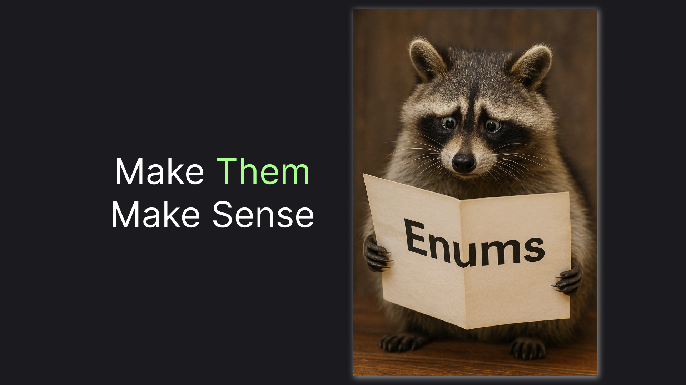
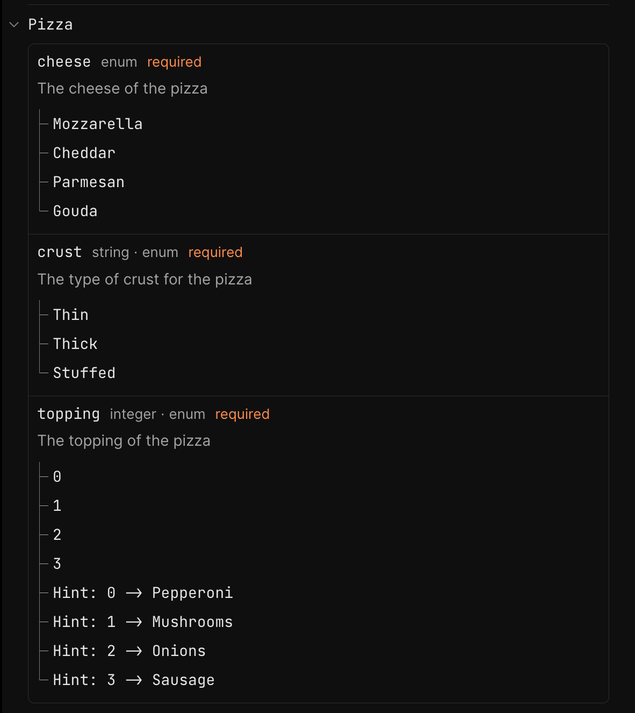

# Enums in OpenApi (Swagger) in .NET 9

> Using OpenApiSchemaTransformer to Customize Various Enum Representations.



Enums in APIs are surprisingly tricky. There are multiple approaches to representing enums, each problematic in its own way. In this article, we are going to take a look at different ways of representing enums in .NET. For each approach, we will take a look at what we will get in terms of OpenAPI and even improve a few representations.

## Getting Started: Integer Enums

## Standard Representation: JsonStringEnumConverter

## Making It Forward-Compatible: IStringEnum

## Recap

In this article, we've implemented extension methods for improving the way enums are represented in OpenAPI documents. Instead of recreating the logic from scratch, you can use the following NuGet package:

> To get the whole system with UI in place, consult [this article](https://medium.com/@vosarat1995/making-your-openapi-swagger-docs-ui-awesome-in-net-9-67fbde6b71b5)

```sh
dotnet add package Nist.Enums.OpenApi
```

To apply those customizations, just call the corresponding extension method on `OpenApiOptions`:

```csharp
builder.Services.AddOpenApi(options =>
{
    options.AddEnumSchemaTransformer();
    options.AddStringEnumSchemaTransformer();
});
```

You will get improved representation of all your standard .NET integer enums right away. And if you want to use the string enums, here's an example of how to achieve that:

```csharp
public class CrustTypes : IStringEnum
{
    public const string Thin = "Thin";
    public const string Thick = "Thick";

    public static string[] All => [Thin, Thick];
}

public class Pizza
{
    [StringEnum<CrustTypes>]
    public required string Crust { get; init; }
}
```

Here's an example of an OpenAPI UI you might expect:



The package, as well as this article, is part of the [NIST project](https://github.com/astorDev/nist). The project's purpose in a few words is to be a Non-Toxic REST alternative, so there are many interesting things beyond enums - check it out and don't hesitate to give it a star! ⭐

Claps for this article are also highly appreciated! 😉