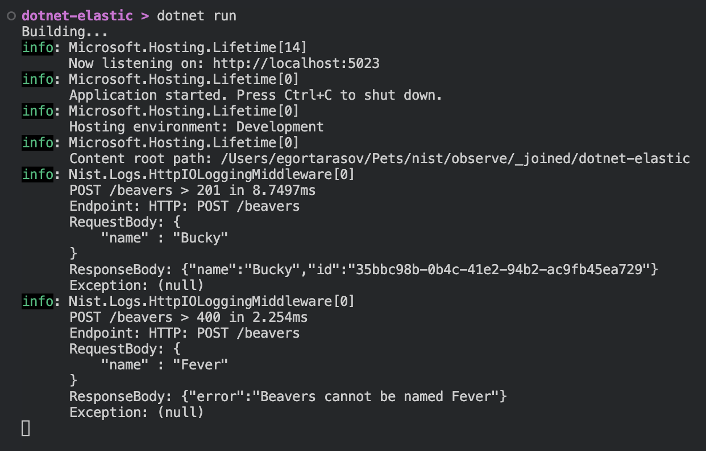
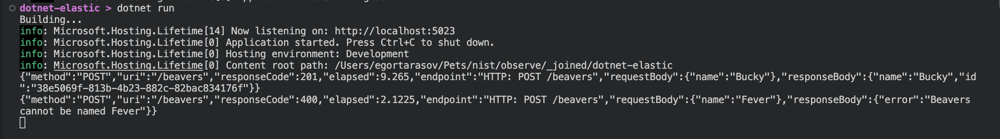

# ASP .NET Core Observability with Elastic Stack

Today we'll discuss a simple, yet powerful way to enhance the observability of any ASP .NET Core app. Earlier I wrote articles about [Request-Response Logging]() in ASP .NET Core, [JSON Logging]() in .NET, and [Exporting Logs]() from Docker to Elastic Stack. This time, I'll combine those articles and set up Kibana, as a cherry on top. Don't worry, I'll start from scratch and show you all the necessary steps, so you don't **have** to read the previous texts. But feel free to check out those articles, as they go in-depth on the topic and shed light on how architectural choices are being made.


## The ASP .NET Core app

```sh
dotnet new web
```

```csharp
var builder = WebApplication.CreateBuilder(args);
var app = builder.Build();

app.MapPost("/beavers", (BeaverCandidate candidate) => {
    if (candidate.Name == "Fever") return Results.BadRequest("Beavers cannot be named Fever");
    var beaver = new Beaver(candidate.Name, Guid.NewGuid());
    return Results.Created($"/beavers/{beaver.Id}", beaver);
});

app.Run();

record BeaverCandidate(string Name);
record Beaver(string Name, Guid Id);
```

```sh
dotnet add package Nist.Logs;
```

```csharp
// using Nist.Logs;

app.UseHttpIOLogging();
```

> In my case the auto-generated port was `5023` it most likely will be different in your case, so you'll have to update the request accordingly.

```http
POST http://localhost:5023/beavers

{
    "name" : "Bucky"
}

POST http://localhost:5023/beavers

{
    "name" : "Fever"
}
```




## JSON logs

```csharp
builder.Logging.AddSimpleConsole(l => l.SingleLine = true);
```

```sh
dotnet add package Astor.Logging;
```

```csharp
// using Astor.Logging;

builder.Logging.AddMiniJsonConsole();
```

```csharp
builder.Logging.AddSimpleConsole(l => l.SingleLine = true).AddMiniJsonConsole();
```

```json
{
  "Logging": {
    "LogLevel": {
      "Default": "Information",
      "Microsoft.AspNetCore": "Warning",
      "Nist.Logs": "None"
    },
    "MiniJsonConsole" : {
      "LogLevel": {
        "Default": "None",
        "Nist.Logs": "Information"
      }
    }
  },
  "AllowedHosts": "*"
}
```


```csharp
app.UseHttpIOLogging(l => l.Message = HttpIOMessagesRegistry.DefaultWithJsonBodies);
```



[Here](https://github.com/astorDev/nist/tree/main/observe/_joined/dotnet-elastic/Program.cs) you can find the full `Program.cs` file for reference.

## The Containers

> `dotnet-elastic` is the name of the csproj.

```dockerfile
FROM mcr.microsoft.com/dotnet/sdk:8.0 AS build-env
WORKDIR /app

COPY . ./
RUN dotnet restore
RUN dotnet publish -c Release -o out

FROM mcr.microsoft.com/dotnet/aspnet:8.0
WORKDIR /app
COPY --from=build-env /app/out .
ENTRYPOINT ["dotnet", "dotnet-elastic.dll"]
```

> Port `8080` is used as default for docker containers since .NET 8. I map this port to the same host port as used with `dotnet run` (5023).

```yaml
services:
  webapi:
    build: .
    ports:
      - "5023:8080"
```

Just note that everything, including version `7.17.3`, is used intentionally here. Refer to the [dedicated article]() for more details:

```yaml
  elasticsearch:
    image: elasticsearch:7.17.3
    environment:
      - discovery.type=single-node

  kibana:
    image: kibana:7.17.3
    environment:
      - ELASTICSEARCH_HOSTS=http://elasticsearch:9200
    ports:
      - 5601:5601
```

## Logs Export


## Kibana Dashboards

We'll build an example panel to get a grasp of how to create one. 

As you may see, although creating a panel is trivial, the text explanation of it is surprisingly tedious. Instead, I've prepared http request files importing complete dashboards.


First, let's create a dashboard for a single service:

> The http files can be run using VS Code and [HttpYac extension](https://marketplace.visualstudio.com/items?itemName=anweber.vscode-httpyac). Or just used as a reference for tools like Postman.


and combined [for all APIs]():


## Finalizing

We've ended up with two simple yet informative dashboards:


Besides that, we've got request-response logs that can be searched and used to build practically any dashboard you can imagine. Pleasantly enough, that is done without creating any dependency between ASP .NET Core and Elasticsearch. You can also use just parts of the solution and even exchange Elastic with a completely different Observability stack (if it is able to import json for structured logs).

Having that said... Claps are appreciated! 👉👈
