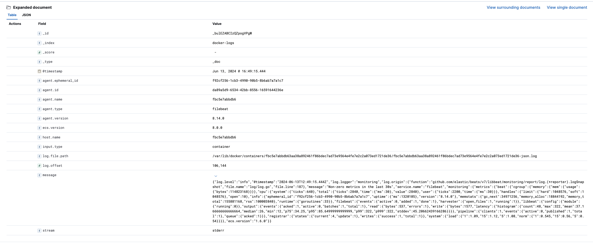
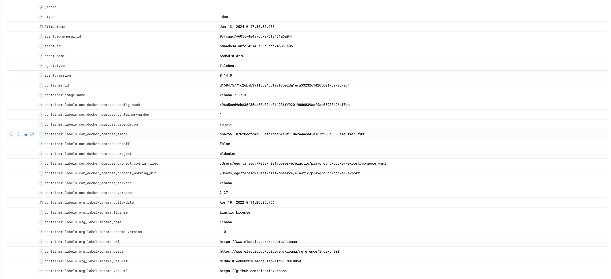

# Elastic Stack with Docker getting started. Elasticsearch, Kibana, and Filebeat.

Elastic Stack is one the most popular observability stacks out there. With its self-hosted solution, extensive tooling, and a wide range of integrations it just doesn't seem to have a good alternative when it comes to structured logs. Trust me, I've spent a lot of time looking for one.

> Well, there's one valid alternative: OpenSearch. But it is a fork, so I'm not sure if it counts. And it seems to have all the same problem Elastic have with a few on top.

Docker in it's turn is probably the most popular process management solution out there. Not only is it likely to be used to deploy elastic stack, it's also probably the most fruitful source of logs. So in this article, we will fire up an elastic stack and ship logs from docker there. So, get on board!


## Firing Elastic Stack up

If you wonder why I say that I was looking for an alternative to elastic, that's because elastic has a few very annoying problems. The first problem is that Elasticsearch demands a lot of resources, especially RAM. So the first thing we need to do is to make sure we set the docker memory limit to at least 3 GB.


The next problem is that it is ridiculously complicated to create a **simple** setup. First of all, by default, it tries to set up a cluster, which is unnecessary for a local trial so we'll have to set `discovery.type=single-node`. Secondly, the newest version has additional overhead with an authentication token, which is so twisted I wasn't able to deploy the version even after numerous attempts. So I'll stick with the latest version that doesn't do it (7.17.3). Anyway, here's a working `docker-compose.yaml`:

> To make it worse the small stack takes about 30 seconds to start up (become functional). So, if you are unable to reach Kibana after starting up, most likely you just need to wait.

```yaml
services:
  elasticsearch:
    image: elasticsearch:7.17.3
    environment:
      - discovery.type=single-node
  
  kibana:
    image: kibana:7.17.3
    environment:
      - ELASTICSEARCH_HOSTS=http://elasticsearch:9200
    ports:
      - 5601:5601
```

So now after running `docker compose up -d`, waiting for about half a minute, and opening [http://localhost:5601/](http://localhost:5601/) we should see Kibana welcome screen


## Shipping logs

By default, docker containers write their logs in JSON files, following this pattern `/var/lib/docker/containers/*/*.log`. That's perfect for us, since Elastic provides a utility to ship logs from files, called `filebeat`. Here's the simplest configuration of the service in a file, called `filebeat.yml`:

```yaml
filebeat.inputs:
- type: container
  paths:
    - '/var/lib/docker/containers/*/*.log'

output.elasticsearch:
  hosts: elasticsearch:9200
  indices:
    - index: "docker-logs"
```

The configuration reads container log files and ships them to the Elasticsearch index, which we named `docker-logs`. To fire up the service, we'll need to give it access to the docker's log folder. That would imply mapping the host docker folder to the container docker folder in read-only mode: `/var/lib/docker:/var/lib/docker:ro` and granting the container root access: `user: root`. Plus, of course, supply the configuration file from the host machine to the container via `./filebeat.yml:/usr/share/filebeat/filebeat.yml`. Here's the complete docker-compose service configuration:

```yaml
  shipper:
    image: docker.elastic.co/beats/filebeat:8.14.0
    user: root
    volumes:
      - /var/lib/docker:/var/lib/docker:ro
      - ./filebeat.yml:/usr/share/filebeat/filebeat.yml
```

Now, if we'll `docker compose up -d` again filebeat will start shipping logs to Elastic. To see the logs in Kibana we will need to create an index pattern. For now, let's grab all data we have using `*` as our index pattern by `Management > Stack Management > Kibana > Index Patterns > Create index pattern > name: *, Timestamp field: @timestampt > Create index pattern`. Now, opening `Analytics > Discover > *` will list all the logs we got from filebeat.


## Organizing our logs

Let's study the log we got:



The first problem you may notice is that now we are unable to tell which container produced the log. Fortunately, filebeat allows us to enhance exported logs using processors. In particular, we'll need a processor, called `add_docker_metadata` which reads the required metadata from the docker socket file:

```yaml
processors:
- add_docker_metadata:
    host: "unix:///var/run/docker.sock"
```

And, of course, we'll also need to map our host socket file to the container socket file, like this: `/var/run/docker.sock:/var/run/docker.sock`. Now, after `docker compose up -d` we'll get a much more detailed log looking like this:



## Wrapping up

This finalizes our introduction. During the article, we deployed `elasticsearch` and `Kibana`. Deployed `filebeat`, configured to export logs from docker to the `elasticsearch`. Set up the most basic index pattern, allowing us to see the exported logs in Kibana. Finally, we've enriched the logs with docker metadata allowing us to make much more sense from the logs. This all required just two files:

> Well, and some manual configuration in Kibana, but 🤫

`compose.yaml`

```yaml
services:
  elasticsearch:
    image: elasticsearch:7.17.3
    environment:
      - discovery.type=single-node
  
  kibana:
    image: kibana:7.17.3
    environment:
      - ELASTICSEARCH_HOSTS=http://elasticsearch:9200
    ports:
      - 5601:5601
  
  shipper:
    image: docker.elastic.co/beats/filebeat:8.14.0
    user: root
    volumes:
      - /var/lib/docker:/var/lib/docker:ro
      - ./filebeat.yml:/usr/share/filebeat/filebeat.yml
      - /var/run/docker.sock:/var/run/docker.sock
```

`filebeat.yaml`

```yaml
filebeat.inputs:
- type: container
  paths:
    - '/var/lib/docker/containers/*/*.log'

processors:
- add_docker_metadata:
    host: "unix:///var/run/docker.sock"

output.elasticsearch:
  hosts: elasticsearch:9200
  indices:
    - index: "docker-logs"
```

Starting from here, we can build advanced observability solutions. But that's a story for another article.
 
Thank you for reading! By the way... claps are appreciated 👉👈
