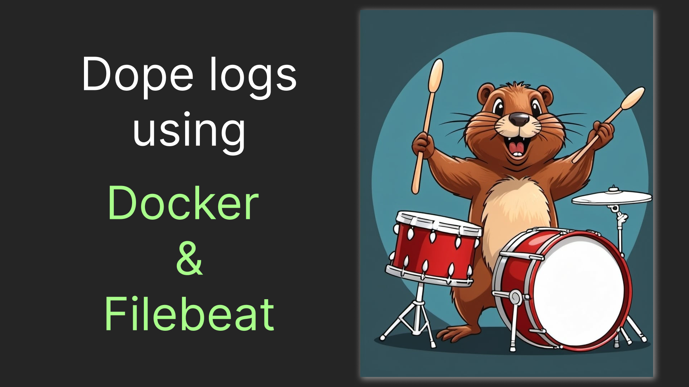

# Filebeat and Elasticsearch for advanced Docker logs.

Elastic stack is one of the most robust observability systems out there. Application logs are most likely to be handled by docker. The most intuitive way to connect them I've found is Filebeat. So in this article, we will try to fire up a complete stack, that allows the export of logs from docker to elasticsearch in a manner that will lay a simple yet powerful foundation of an observability solution. So, start the beat!



## Firing up the foundations

Deploying and connecting all the basic components is a twisted task even in the most basic setup. Therefore, in my [previous article]() I've talked in depth about the basic setup. This time we'll start from what we got there. If something in the setup wouldn't make sense, feel free to refer to the [old piece](). Anyway, here's the initial setup we got:

`compose.yaml`

```yaml
services:
  elasticsearch:
    image: elasticsearch:7.17.3
    environment:
      - discovery.type=single-node
  
  kibana:
    image: kibana:7.17.3
    environment:
      - ELASTICSEARCH_HOSTS=http://elasticsearch:9200
    ports:
      - 5601:5601
  
  shipper:
    image: docker.elastic.co/beats/filebeat:8.14.0
    user: root
    volumes:
      - /var/lib/docker:/var/lib/docker:ro
      - ./filebeat.yml:/usr/share/filebeat/filebeat.yml
      - /var/run/docker.sock:/var/run/docker.sock
```

`filebeat.yaml`

```yaml
filebeat.inputs:
- type: container
  paths:
    - '/var/lib/docker/containers/*/*.log'

processors:
- add_docker_metadata:
    host: "unix:///var/run/docker.sock"

output.elasticsearch:
  hosts: elasticsearch:9200
  indices:
    - index: "docker-logs"
```

Which produce logs looking something like this:

```json
{
  "_index": "docker-logs",
  "_type": "_doc",
  "_id": "kafMFZABr1cUle7yj2na",
  "_version": 1,
  "_score": 1,
  "_ignored": [
    "message.keyword"
  ],
  "_source": {
    "@timestamp": "2024-06-14T08:10:41.019Z",
    "input": {
      "type": "container"
    },
    "ecs": {
      "version": "8.0.0"
    },
    "host": {
      "name": "56438defcbd0"
    },
    "agent": {
      "id": "5c4d1557-269c-49ff-a0b8-ac8915a6af8f",
      "name": "56438defcbd0",
      "type": "filebeat",
      "version": "8.14.0",
      "ephemeral_id": "d849fdeb-6afc-4a12-8242-0788015b2d44"
    },
    "container": {
      "id": "56438defcbd0d0bc1cfc28a3ae145a73e4745473ca0a0bc2af2f0f437c8bbbb2",
      "labels": {
        "version": "8.14.0",
        "org_opencontainers_image_version": "20.04",
        "org_label-schema_license": "Elastic License",
        "org_label-schema_version": "8.14.0",
        "io_k8s_description": "Filebeat sends log files to Logstash or directly to Elasticsearch.",
        "com_docker_compose_container-number": "1",
        "desktop_docker_io/binds/1/Source": "/Users/egortarasov/Pets/nist/observe/elastic/playground/docker-advanced/filebeat.yml",
        "url": "https://www.elastic.co/beats/filebeat",
        "org_label-schema_vendor": "Elastic",
        "org_label-schema_build-date": "2024-05-31T15:22:45Z",
        "org_label-schema_vcs-url": "github.com/elastic/beats/v7",
        "com_docker_compose_project": "docker-advanced",
        "org_opencontainers_image_vendor": "Elastic",
        "desktop_docker_io/binds/2/Target": "/var/run/docker.sock",
        "desktop_docker_io/binds/2/SourceKind": "dockerSocketProxied",
        "description": "Filebeat sends log files to Logstash or directly to Elasticsearch.",
        "desktop_docker_io/binds/1/Target": "/usr/share/filebeat/filebeat.yml",
        "org_opencontainers_image_title": "Filebeat",
        "com_docker_compose_version": "2.27.1",
        "release": "1",
        "name": "filebeat",
        "com_docker_compose_config-hash": "40bb1d7071e5df23cd55e3af6ffc532e09410a4c82c6182b6a967552f3e474cf",
        "com_docker_compose_project_working_dir": "/Users/egortarasov/Pets/nist/observe/elastic/playground/docker-advanced",
        "org_opencontainers_image_ref_name": "ubuntu",
        "maintainer": "infra@elastic.co",
        "vendor": "Elastic",
        "desktop_docker_io/binds/2/Source": "/var/run/docker.sock",
        "org_opencontainers_image_created": "2024-05-31T15:22:45Z",
        "org_label-schema_vcs-ref": "de52d1434ea3dff96953a59a18d44e456a98bd2f",
        "com_docker_compose_image": "sha256:f217457d9ebe8713742acb07e4209d8bf2b81298ff03277eaa28f098c93d2f12",
        "org_label-schema_name": "filebeat",
        "org_label-schema_schema-version": "1.0",
        "org_opencontainers_image_licenses": "Elastic License",
        "org_label-schema_url": "https://www.elastic.co/beats/filebeat",
        "io_k8s_display-name": "Filebeat image",
        "summary": "filebeat",
        "license": "Elastic License",
        "com_docker_compose_depends_on": "",
        "desktop_docker_io/binds/1/SourceKind": "hostFile",
        "com_docker_compose_service": "shipper",
        "com_docker_compose_project_config_files": "/Users/egortarasov/Pets/nist/observe/elastic/playground/docker-advanced/compose.yaml",
        "com_docker_compose_oneoff": "False"
      },
      "image": {
        "name": "docker.elastic.co/beats/filebeat:8.14.0"
      },
      "name": "docker-advanced-shipper-1"
    },
    "log": {
      "offset": 29401,
      "file": {
        "path": "/var/lib/docker/containers/56438defcbd0d0bc1cfc28a3ae145a73e4745473ca0a0bc2af2f0f437c8bbbb2/56438defcbd0d0bc1cfc28a3ae145a73e4745473ca0a0bc2af2f0f437c8bbbb2-json.log"
      }
    },
    "stream": "stderr",
    "message": "{\"log.level\":\"info\",\"@timestamp\":\"2024-06-14T08:10:41.016Z\",\"log.logger\":\"monitoring\",\"log.origin\":{\"function\":\"github.com/elastic/beats/v7/libbeat/monitoring/report/log.(*reporter).logSnapshot\",\"file.name\":\"log/log.go\",\"file.line\":187},\"message\":\"Non-zero metrics in the last 30s\",\"service.name\":\"filebeat\",\"monitoring\":{\"metrics\":{\"beat\":{\"cgroup\":{\"cpu\":{\"id\":\"/\"},\"memory\":{\"id\":\"/\",\"mem\":{\"usage\":{\"bytes\":98902016}}}},\"cpu\":{\"system\":{\"ticks\":120,\"time\":{\"ms\":120}},\"total\":{\"ticks\":640,\"time\":{\"ms\":640},\"value\":640},\"user\":{\"ticks\":520,\"time\":{\"ms\":520}}},\"handles\":{\"limit\":{\"hard\":1048576,\"soft\":1048576},\"open\":17},\"info\":{\"ephemeral_id\":\"d849fdeb-6afc-4a12-8242-0788015b2d44\",\"name\":\"filebeat\",\"uptime\":{\"ms\":30111},\"version\":\"8.14.0\"},\"memstats\":{\"gc_next\":42845240,\"memory_alloc\":22004248,\"memory_sys\":76190984,\"memory_total\":154130944,\"rss\":97427456},\"runtime\":{\"goroutines\":68}},\"filebeat\":{\"events\":{\"active\":22,\"added\":1234,\"done\":1212},\"harvester\":{\"open_files\":7,\"running\":7,\"started\":7}},\"libbeat\":{\"config\":{\"module\":{\"running\":0}},\"output\":{\"events\":{\"acked\":1205,\"active\":0,\"batches\":2,\"total\":1205},\"read\":{\"bytes\":9503,\"errors\":2},\"type\":\"elasticsearch\",\"write\":{\"bytes\":291196,\"latency\":{\"histogram\":{\"count\":2,\"max\":845,\"mean\":492.5,\"median\":492.5,\"min\":140,\"p75\":845,\"p95\":845,\"p99\":845,\"p999\":845,\"stddev\":352.5}}}},\"pipeline\":{\"clients\":1,\"events\":{\"active\":22,\"filtered\":7,\"published\":1227,\"retry\":3932,\"total\":1234},\"queue\":{\"acked\":1205,\"max_events\":3200}}},\"registrar\":{\"states\":{\"current\":7,\"update\":1212},\"writes\":{\"success\":2,\"total\":2}},\"system\":{\"cpu\":{\"cores\":2},\"load\":{\"1\":2.75,\"15\":0.22,\"5\":0.67,\"norm\":{\"1\":1.375,\"15\":0.11,\"5\":0.335}}}},\"ecs.version\":\"1.6.0\"}}"
  }
}
```

## Indexing the logs right

There's a few unsatisfying things about current log. First of all, logs from all containers end up in a single elasticsearch "index" - which is roughly analogous to a table in relational database. This prevents us from using index pattern for really anything useful. Let's fix this! Here are some ideas of what we may want to know from the index names:

- **Service that produced the log**. So that we can see logs produced by a particular service. `container.name` seems to suit the purpose the best. It does append instance index, but we just need to keep that in mind when creating an index pattern.
- **Type/Family of service that produced the log**. Let's say we have a few services that produce similar logs e.g. HTTP API services. If we want to get holistic view on their performance we would need to be able to filter them by some common index pattern. We can use docker labels to identify such services. Let's call the label `family`
- **Date when the logs was produced**. Logs take a lot of space and after some time are likely to become obsolete. Providing the date in index names will significantly simplify an index lifecycle management, including deleting old indexes.

Fortunately, filebeat allows versatile dynamic configuration of index names based on the log fields with patterns, like `%{[field-name]}`. And there is also a special pattern for current date: `%{+yyyy.MM.dd}`. Here's the index template with parts we just discussed:

```
docker-logs-%{[container.labels.family]}-%{[container.name]}-%{+yyyy.MM.dd}
```

However, you may notice that our logs don't have a field `container.labels.family`. Therefore the template will "fail" for the logs we have. How do we fix that? Well, the way `indices` work is by trying to apply `index`es one by one. So we can easily provide a fallback template. This what the resulting configuration will look like:

```yaml
output.elasticsearch:
  hosts: elasticsearch:9200
  indices:
    - index: "docker-logs-%{[container.labels.family]}-%{[container.name]}-%{+yyyy.MM.dd}"
    - index: "docker-logs-nofamily-%{[container.name]}-%{+yyyy.MM.dd}"
```

Let's also give a family to just one of our containers. Let's for example give `kibana` a `ui` family. Here's the code:

```yaml
  kibana:
    image: kibana:7.17.3
    labels:
      - family=ui
    environment:
      - ELASTICSEARCH_HOSTS=http://elasticsearch:9200
    ports:
      - 5601:5601
```

With that we'll be able to see all `ui` family logs using `docker-logs-ui-*` pattern, all `elasticsearch` service logs using `*-elasticsearch-*`, and so on.

## Getting the important stuff

You may notice, that all our deployed service produce not just text logs, but JSON. This is probably the most powerful ability of our stack - structured logging. What that means is that we can extract fields from the message JSON and use them for almost any analytics we can think of. This is enabled by processor, called [decode_json_fields](https://www.elastic.co/guide/en/beats/filebeat/current/decode-json-fields.html). We'll decode JSON from the `message` field into the field called `x` for simplicity sake. Here's the configuration snippet:

```yaml
- decode_json_fields:
    fields: ["message"]
    target: "x"
```

So, now we have a lot more useful fields in our records. But we have a ton of fields in general, too. Frankly, most of them doesn't seem useful. Fortunately, filebeat provides yet another useful processor called `drop_fields`. Using it we can specify both precise fields and using the syntax like `/regex/` regular expression. Probably the most cluttering component of our logs is container labels. Let's drop them all, except the `family` label, we actually use. 

> Here's the catch! Filebeat is written in go. And go regexes are very limited. They only comply with RE2 standards, instead of PCRE. This prevents us from doing a negative lookahead in regex. So instead we will exclude fields having at least one underscore after label.

Regular expression for that will be `container\.labels\..*_.*`. Agent information doesn't seem to be useful, too. Here's the regex for that: `agent.*`. This cleanup is probably sufficient. Let's just drop a single useless field without using a regular expression: `stream` fields seems redundant enough. We, probably, also don't want a error in case a field is already not in the document, so we'll set `ignore_missing` to `true`. And this is the configuration we got:

```yaml
- drop_fields:
    fields:
      - "/container\\.labels\\..*_.*/"
      - "/agent.*/"
      - "stream"
    ignore_missing: true
```

## Let's wrap it up!

Here's an example of log we get now:

```json
{
    "_index": "docker-logs-ui-docker-advanced-kibana-1-2024.06.14",
    "_type": "_doc",
    "_id": "ygxAF5ABoBCFDa1cLkIs",
    "_version": 1,
    "_score": 1,
    "_source": {
        "@timestamp": "2024-06-14T14:56:37.711Z",
        "host": {
            "name": "56438defcbd0"
        },
        "x": {
            "pid": 7,
            "message": "Kibana is now available (was degraded)",
            "type": "log",
            "@timestamp": "2024-06-14T14:56:37+00:00",
            "tags": [
                "info",
                "status"
            ]
        },
        "message": "{\"type\":\"log\",\"@timestamp\":\"2024-06-14T14:56:37+00:00\",\"tags\":[\"info\",\"status\"],\"pid\":7,\"message\":\"Kibana is now available (was degraded)\"}",
        "log": {
            "offset": 1782434,
            "file": {
                "path": "/var/lib/docker/containers/e727845bca678a775953196ca4f3b4122cf334b3a01cf1f676b298d165653d74/e727845bca678a775953196ca4f3b4122cf334b3a01cf1f676b298d165653d74-json.log"
            }
        },
        "input": {
            "type": "container"
        },
        "ecs": {
            "version": "8.0.0"
        },
        "container": {
            "id": "e727845bca678a775953196ca4f3b4122cf334b3a01cf1f676b298d165653d74",
            "name": "docker-advanced-kibana-1",
            "labels": {
                "family": "ui"
            },
            "image": {
                "name": "kibana:7.17.3"
            }
        }
    }
}
```

Although the record is huge now it contains supposedly useful data from the actual log message, instead of mostly pointless docker metadata. Here's how `compose.yaml` and `filebeat.yml` look after the changes we made:

```yaml
services:
  elasticsearch:
    image: elasticsearch:7.17.3
    environment:
      - discovery.type=single-node
  
  kibana:
    image: kibana:7.17.3
    labels:
      - family=ui
    environment:
      - ELASTICSEARCH_HOSTS=http://elasticsearch:9200
    ports:
      - 5601:5601
  
  shipper:
    image: docker.elastic.co/beats/filebeat:8.14.0
    user: root
    volumes:
      - /var/lib/docker:/var/lib/docker:ro
      - ./filebeat.yml:/usr/share/filebeat/filebeat.yml
      - /var/run/docker.sock:/var/run/docker.sock
```

```yaml
filebeat.inputs:
- type: container
  paths:
    - '/var/lib/docker/containers/*/*.log'

processors:
- add_docker_metadata:
    host: "unix:///var/run/docker.sock"

- decode_json_fields:
    fields: ["message"]
    target: "x"

- drop_fields:
    fields:
      - "/container\\.labels\\..*_.*/"
      - "/agent.*/"
      - "stream"
    ignore_missing: true

output.elasticsearch:
  hosts: elasticsearch:9200
  indices:
    - index: "docker-logs-%{[container.labels.family]}-%{[container.name]}-%{+yyyy.MM.dd}"
    - index: "docker-logs-nofamily-%{[container.name]}-%{+yyyy.MM.dd}"
```

With that setup we export structured logs to Elasticsearch, allowing creation of any metric we could possibly imagine from the supplied logs. Beyond that, we can now create various index patterns for bunch of possible use cases. As the cherry on top, we cleaned up our logs from useless metadata.

Thank you for reading! By the way... claps are appreciated 👉👈