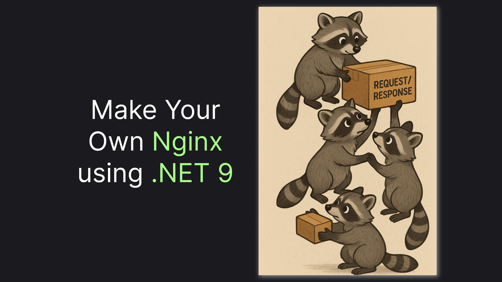

# Proxy HTTP Requests in .NET 9 Like a Pro

> A Simple Guide to Writing Your Own Reverse-Proxy using C# in 2025.



Proxying, or reverse-proxying, a request is a pretty common task, especially in a microservices architecture. One of the scenarios I bump into frequently is developing a gateway, authorizing a user, and proxying a request to a private microservice by an updated path. There's already a tool in the .NET ecosystem handling the task. It is called [YARP](https://github.com/dotnet/yarp/tree/main) - Yet Another Reverse Proxy. However, for me, it feels over-engineered. If you feel the same, welcome to the article, where we will create our own simple version, although inspired by YARP.

> If you don't want to implement it, but are still interested in getting a simple reverse-proxy, jump straight to the end of the article, to the [TLDR; section](#tldr).

## Building the Skeleton: Proxy Extension Method

Let's start straight with the spoilers. To build a proxy, we will essentially need just one method, called `Proxy`. The method will copy the incoming request from the `HttpContext` to the new `HttpRequestMessage` and copy a received `HttpResponseMessage` back to the `HttpContext`s `HttpResponse` property. 

Of course, we will also do a couple of modifications along the way. We will change the route, host, and remove chunking. Here's the code:

> It would be cool to just make the 4 lines implementation. Unfortunately, the  `ToProxyMessageWith` and `CopyTo` methods do not exist and we will have to implement them.

```csharp
public static async Task Proxy(this HttpMessageInvoker invoker, HttpContext context, string? route = null, CancellationToken? cancellationToken = null)
{
    var request = context.Request.ToProxyMessageWith(route);
    var response = await invoker.SendAsync(request, cancellationToken ?? CancellationToken.None);
    await response.CopyTo(context.Response);

    // SendAsync removes chunking from the response. This removes the header so it doesn't expect a chunked response.
    context.Response.Headers.Remove("transfer-encoding");
}
```

Now, let's peek into the `ToProxyMessageWith` implementation. The method will construct a new `HttpRequestMessage` using the source method, a passed root, source headers, and content. Here's the code: 

> Of course, we will copy all headers except the `Host`, since that's basically the point of a proxy to overwrite the host.

```csharp
public static HttpRequestMessage ToProxyMessageWith(this HttpRequest source, string? route = null)
{
    var target = new HttpRequestMessage(
        method: new(source.Method), 
        requestUri: route
    );

    target.AddHeaders(source.Headers.Except("Host"));
    target.Content = source.OptionalStreamContent();

    return target;
}
```

We will need to copy even less for the response: just the status code, headers, and content. Here, the code is much simpler:

```csharp
public static async Task CopyTo(this HttpResponseMessage source, HttpResponse target)
{
    target.StatusCode = (int)source.StatusCode;
    target.SetHeaders(source.AllHeaders());
    await target.CopyContentFrom(source.Content);
}
```

Here's the code in assembly just for reference:

```csharp
using Microsoft.AspNetCore.Http;

namespace Nist;

public static class ProxyExtensions
{
    public static async Task Proxy(this HttpMessageInvoker invoker, HttpContext context, string? route = null, CancellationToken? cancellationToken = null)
    {
        var request = context.Request.ToProxyMessageWith(route);
        var response = await invoker.SendAsync(request, cancellationToken ?? CancellationToken.None);
        await response.CopyTo(context.Response);

        // SendAsync removes chunking from the response. This removes the header so it doesn't expect a chunked response.
        context.Response.Headers.Remove("transfer-encoding");
    }

    public static HttpRequestMessage ToProxyMessageWith(this HttpRequest source, string? route = null)
    {
        var target = new HttpRequestMessage(
            method: new(source.Method), 
            requestUri: route
        );

        target.AddHeaders(source.Headers.Except("Host"));
        target.Content = source.OptionalStreamContent();

        return target;
    }

    public static async Task CopyTo(this HttpResponseMessage source, HttpResponse target)
    {
        target.StatusCode = (int)source.StatusCode;
        target.SetHeaders(source.AllHeaders());
        await target.CopyContentFrom(source.Content);
    }
}
```

Unfortunately, most of the methods for copying are also missing from the built-in libraries, and we will have to implement them ourselves. Let's do just that in the next sections, starting with headers.

## Copying Headers: The Peculiar .NET Structuring

.NET has quite an interesting model for representing HTTP headers. Although technically a header is just a header, .NET also splits the header into two categories based on their semantics: `RequestHeaders` and `ContentHeaders`.

Let me show you a quick experiment to explain what I mean. Here's the experiment code:

```csharp
var client = new HttpClient() { BaseAddress = new Uri("https://api.spacexdata.com/v4") };
var response = await client.GetAsync("launches/latest");

Console.WriteLine("\n\n------Headers directly in response:-----\n\n");
foreach (var header in response.Headers)
    Console.WriteLine($"{header.Key}: {string.Join(", ", header.Value)}");

Console.WriteLine("\n\n------Headers in content:----------\n\n");
foreach (var header in response.Content.Headers)
    Console.WriteLine($"{header.Key}: {string.Join(", ", header.Value)}");
```

If you run the code, you should see the output looking something like this:

```text
------Headers directly in response:-----
 
 
 Date: Sun, 20 Apr 2025 08:47:59 GMT
 Connection: keep-alive
 Access-Control-Allow-Origin: *
 Access-Control-Expose-Headers: spacex-api-cache,spacex-api-response-time
 Alt-Svc: h3=":443"
 Content-Security-Policy: default-src 'self';base-uri 'self';block-all-mixed-content;font-src 'self' https: data:;frame-ancestors 'self';img-src 'self' data:;object-src 'none';script-src 'self';script-src-attr 'none';style-src 'self' https: 'unsafe-inline';upgrade-insecure-requests
 Expect-CT: max-age=0
 Referrer-Policy: no-referrer
 Server: cloudflare
 Spacex-Api-Response-Time: 0ms
 Strict-Transport-Security: max-age=15552000; includeSubDomains
 Vary: Origin
 X-Content-Type-Options: nosniff
 X-Dns-Prefetch-Control: off
 X-Download-Options: noopen
 X-Frame-Options: SAMEORIGIN
 X-Permitted-Cross-Domain-Policies: none
 X-XSS-Protection: 0
 Cf-Cache-Status: DYNAMIC
 CF-RAY: 93336148cbe0d104-CDG
 
 
 ------Headers in content:----------
 
 
 Content-Type: text/plain; charset=utf-8
 Content-Length: 9
```

Although the separation makes some sense, it doesn't make our lives easier, since we have to copy all the headers. 

It also doesn't help that .NET represents headers somewhat differently, depending on the context. So the first thing we will need to do is to make a universal model, we will use for our headers:

```csharp
public record HttpHeader(string Key, IEnumerable<string> Value)
{
    public static implicit operator HttpHeader(KeyValuePair<string, StringValues> header) => new(header.Key, header.Value);
}
```

Now, let's do a set of extension methods. Let's start with the one for the requests:

> I hope the code is pretty self-explanatory, so I won't bother you with an explanation. Feel free to ask in the comments if something is unclear.

```csharp
public static class RequestHeaderExtensions
{
    public static IEnumerable<HttpHeader> Except(this IHeaderDictionary headers, string headerKey)
    {
        return headers
            .Where(x => x.Key != headerKey)
            .Select(x => new HttpHeader(x.Key, x.Value));
    }

    public static void AddHeaders(this HttpRequestMessage requestMessage, IEnumerable<HttpHeader> headers)
    {
        foreach (var header in headers)
        {
            requestMessage.AddHeader(header);
        }
    }

    public static HttpHeader? AddHeader(this HttpRequestMessage request, HttpHeader header)
    {
        return request.AddRequestHeader(header) ?? request.AddContentHeader(header);
    }

    public static HttpHeader? AddRequestHeader(this HttpRequestMessage request, HttpHeader candidate)
    {
        var success = request.Headers.TryAddWithoutValidation(candidate.Key, candidate.Value);
        return success ? candidate : null;
    }

    public static HttpHeader? AddContentHeader(this HttpRequestMessage request, HttpHeader candidate)
    {
        var success = request.Content?.Headers.TryAddWithoutValidation(candidate.Key, candidate.Value) ?? false;
        return success ? new HttpHeader(candidate.Key, candidate.Value) : null;
    }
}
```

It's a little bit easier for response since we **can** just set a header by a key, unlike with requests:

```csharp
public static class ResponseHeaderExtensions
{
    public static IEnumerable<HttpHeader> AllHeaders(this HttpResponseMessage response)
    {
        return response.Headers.Concat(response.Content.Headers)
            .Select(x => new HttpHeader(x.Key, x.Value));
    }

    public static void SetHeaders(this HttpResponse response, IEnumerable<HttpHeader> headers)
    {
        foreach (var header in headers)
        {
            response.Headers[header.Key] = header.Value.ToArray();
        }
    }
}
```

Quite a journey for copying key-value pairs, huh? Well, gladly, content copying is much easier. Let's get to it!

## Proxying Content: Keep It Streamed

The key for content proxying is relatively simple: Use streams. What we don't want to do is to actually keep the stream content in some intermediary variable. Here's the code that does just that: 

```csharp
using Microsoft.AspNetCore.Http;

namespace Nist;

public static class ContentExtensions
{
    public static StreamContent? OptionalStreamContent(this HttpRequest request)
    {
        return request.ContentLength > 0 ? new StreamContent(request.Body) : null;
    }

    public static async Task CopyContentFrom(this HttpResponse response, HttpContent content)
    {
        using var stream = await content.ReadAsStreamAsync();
        await stream.CopyToAsync(response.Body);
    }
}
```

This should cover all the custom extension methods we had in the initial setup. Now, let's see our `Proxy` method in action!

## Testing The Proxy: Utilizing Postman Echo

To test the proxying, we will need a web app. Let's use the super simple minimal API template:

```sh
dotnet new web
```

We'll use the `postman-echo` service for our testing. All we'd have to do is register the typed client in our DI container, access it `HttpClient` and call our `Proxy` method. Notice how we also changed the path from `post` to `echo`:

```csharp
var builder = WebApplication.CreateBuilder(args);

builder.Services.AddHttpClient<PostmanEchoClient>(client => {
    client.BaseAddress = new Uri("https://postman-echo.com");
});

var app = builder.Build();

app.MapPost("/echo", async (PostmanEchoClient echo, HttpContext context) => {
    await echo.Http.Proxy(context, "post");
});

app.Run();

public class PostmanEchoClient(HttpClient http) {
    public HttpClient Http => http;
}
```

Now, let's call our echo endpoint with an example request body:

> This article uses `httpyac` syntax for requests. I've written a [dedicated article](https://medium.com/@vosarat1995/best-postman-alternative-5890e3e9ddc7) about the tool, but you should be able to understand without any problems anyway.

```http
POST http://localhost:5155/echo

{
    "example" : "one"
}
```

We should get the following response straight from our localhost, proxied from `postman-echo`:

```json
{
  "args": {},
  "data": {
    "example": "one"
  },
  "files": {},
  "form": {},
  "headers": {
    "host": "postman-echo.com",
    "x-request-start": "t1745139404.344",
    "connection": "close",
    "content-length": "25",
    "x-forwarded-proto": "https",
    "x-forwarded-port": "443",
    "x-amzn-trace-id": "Root=1-6804b6cc-17c6d05d291f9b32648d2035",
    "accept": "*/*",
    "user-agent": "httpyac",
    "accept-encoding": "gzip, deflate, br",
    "traceparent": "00-718835a3ad62bd56f53f966e83e1545a-dd3329f7582f0a2e-00",
    "content-type": "application/json"
  },
  "json": {
    "example": "one"
  },
  "url": "https://postman-echo.com/post"
}
```

We'll call it a success! The next section contains a short recap of what we have done, along with one more thing that will make our lives easier. Let's jump straight to it!

## TLDR;

In this article, we've built a proxy extension method for `HttpClient`. Instead of implementing it again in your project, you can just install the package below:

```sh
dotnet add package Nist.Proxy
```

Here's the most basic test for the package:

> You can find the complete code [here on Github](https://github.com/astorDev/nist/blob/main/proxy/dotnet/playground/Program.cs). Note that `AddHttpService` is part of the `Nist.Registration` package, so you need to install it first. 

```csharp
builder.Services.AddHttpService<GithubClient>(new Uri("http://api.github.com"));

// ..

app.MapGet("/author", async (GithubClient github, HttpContext context) => {
    await github.Http.Proxy(context, "users/astorDev");
});

public class GithubClient(HttpClient http) {
    public HttpClient Http => http;
}
```

Executing `GET /author`, you should get basic info about the GitHub profile of me, the author of this article. 

The package, as well as this article, is part of the [NIST project](https://github.com/astorDev/nist). The project's purpose in a few words is to be a Non-Toxic REST alternative, so there's many interesting stuff beyond proxying - check it out and don't hesitate to give it a star! ⭐

Claps for this article are also highly appreciated! 😉
