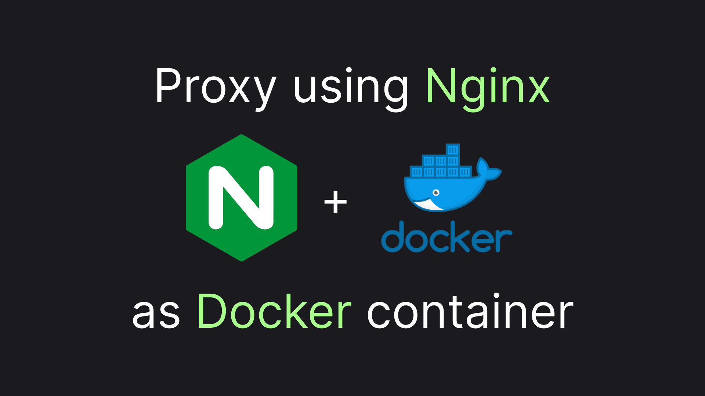
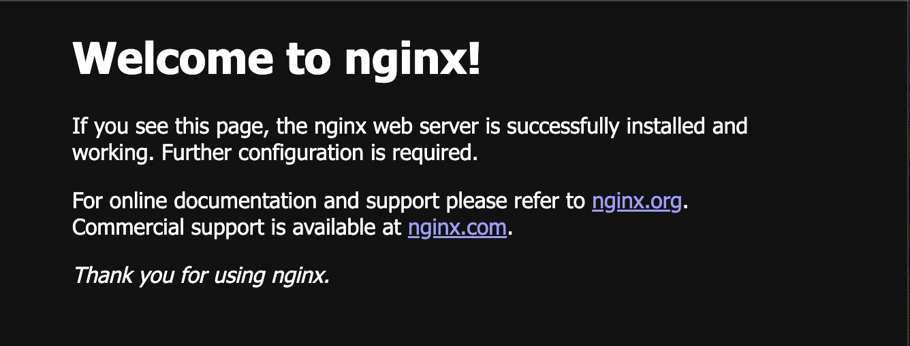

# Nginx and Docker: Getting Started

Nginx and Docker are probably two dominant components of backend infrastructure nowadays. Still, there's not much information on how to make them play together. This article attempts to fix it by providing a basis for a simple yet flexible and scalable setup of the nginx docker container. So, if you will, let's jump to the code!



## The Simplest Nginx Docker Setup

To get started with nginx in docker all we have to do is to map the port `80` from the base nginx image. Here's `compose.yml` allowing us to do just that:

```yaml
name: playground

services:
  nginx:
    image: nginx
    ports:
      - 4500:80
```

By running `docker compose up -d` we should be able to see the page below, by opening `http://localhost:4500/` in any browser:



And that's how you configure nginx with docker, thank you for reading! 🎉

Just kidding... although the setup does work, there is not much use in it. To learn how to enhance our nginx setup to do something meaningful let's first investigate how our default setup works.

## Demystifying The Simplest Nginx Docker Setup

First of all, how does nginx serve something, having that we didn't provide it with any configuration. Well, the container does ship with the default configuration in place. To figure out how this configuration looks we can use the command below:

```sh
docker exec -it playground-nginx-1 cat etc/nginx/nginx.conf
```

Here's the content of our root configuration file, for your reference:

```conf
user  nginx;
worker_processes  auto;

error_log  /var/log/nginx/error.log notice;
pid        /var/run/nginx.pid;


events {
    worker_connections  1024;
}


http {
    include       /etc/nginx/mime.types;
    default_type  application/octet-stream;

    log_format  main  '$remote_addr - $remote_user [$time_local] "$request" '
                      '$status $body_bytes_sent "$http_referer" '
                      '"$http_user_agent" "$http_x_forwarded_for"';

    access_log  /var/log/nginx/access.log  main;

    sendfile        on;
    #tcp_nopush     on;

    keepalive_timeout  65;

    #gzip  on;

    include /etc/nginx/conf.d/*.conf;
}
```

Well, the file mostly configures various boring details about our web server. But there's one line we should focus on:

```conf
include /etc/nginx/conf.d/*.conf;
```

The keyword `include` is the thing allowing nginx to have a composable configuration. The command basically means to insert the content of the files, matching the `/etc/nginx/conf.d/*.conf` pattern in the block where the `include` command resides. In the default configuration, there's only one file in the `/etc/nginx/conf.d/` directory. Let's see its content, too:

```sh
docker exec -it playground-nginx-1 cat /etc/nginx/conf.d/default.conf
```

Here's the whole file, just for reference:

```conf
server {
    listen       80;
    listen  [::]:80;
    server_name  localhost;

    #access_log  /var/log/nginx/host.access.log  main;

    location / {
        root   /usr/share/nginx/html;
        index  index.html index.htm;
    }

    #error_page  404              /404.html;

    # redirect server error pages to the static page /50x.html
    #
    error_page   500 502 503 504  /50x.html;
    location = /50x.html {
        root   /usr/share/nginx/html;
    }

    # proxy the PHP scripts to Apache listening on 127.0.0.1:80
    #
    #location ~ \.php$ {
    #    proxy_pass   http://127.0.0.1;
    #}

    # pass the PHP scripts to FastCGI server listening on 127.0.0.1:9000
    #
    #location ~ \.php$ {
    #    root           html;
    #    fastcgi_pass   127.0.0.1:9000;
    #    fastcgi_index  index.php;
    #    fastcgi_param  SCRIPT_FILENAME  /scripts$fastcgi_script_name;
    #    include        fastcgi_params;
    #}

    # deny access to .htaccess files, if Apache's document root
    # concurs with nginx's one
    #
    #location ~ /\.ht {
    #    deny  all;
    #}
}
```

And here's the most fancy part, we will focus on:

```conf
root   /usr/share/nginx/html;
```

This command roughly tells nginx to serve static content from the folder `/usr/share/nginx/html`. As earlier, there's just one file in the folder:

```sh
docker exec -it playground-nginx-1 cat /usr/share/nginx/html/index.html
```

And here goes our fine welcome page:

```html
<!DOCTYPE html>
<html>
<head>
<title>Welcome to nginx!</title>
<style>
html { color-scheme: light dark; }
body { width: 35em; margin: 0 auto;
font-family: Tahoma, Verdana, Arial, sans-serif; }
</style>
</head>
<body>
<h1>Welcome to nginx!</h1>
<p>If you see this page, the nginx web server is successfully installed and
working. Further configuration is required.</p>

<p>For online documentation and support please refer to
<a href="http://nginx.org/">nginx.org</a>.<br/>
Commercial support is available at
<a href="http://nginx.com/">nginx.com</a>.</p>

<p><em>Thank you for using nginx.</em></p>
</body>
</html>
```

This is the markdown of the page we saw before when opening `http://localhost:4500/`. Now, that we have traced the whole default configuration path, we are ready to tweak it to make something cool!

## Mocking Json API Endpoints

We don't need to override any of the high-level nginx configurations, so we'll leave `etc/nginx/nginx.conf` out of this. But we do want to change what we serve hence we need to replace `/etc/nginx/conf.d/default.conf`. We'll need to create our replacement file, let's call it simply `nginx.conf`

There are two ways to supply our configuration files to nginx - via volume binding or via the `COPY` command during the build. In my view, changing the nginx configuration creates a new setup and an appropriate way to update it will be to create a new image, rather than replacing the configuration and restarting a container. That is the case for building an image via a `Dockerfile`. Here's the very simple build file we'll get:

```dockerfile
FROM nginx
COPY nginx.conf /etc/nginx/conf.d/default.conf
```

And we'll also need to update our compose to build the image, instead of just using the base one.

```yaml
name: playground

services:
  nginx:
    build: .
    ports:
      - 4500:80
```

We are going to create a primitive Web API, in which the `/about` endpoint will return a simple json describing the service and all the other roots leading to `404` with JSON describing the problem.

```conf
server {
    location /about {
        default_type application/json;
        return 200 '{"description":"nginx proxy","version":"1.0"}';
    }

    error_page 404 @404_json;
    location @404_json {
      default_type application/json;
      return 404 '{"statusCode":"NotFound","reason":"NoNginxRoute"}';
    }
}
```

Let's build our new app `docker compose up -d --build` and check how our server is responding by sending `curl localhost:4500/about`. Here's what we should get as a response:

```json
{"description":"nginx proxy","version":"1.0"}
```

And if we send a `curl localhost:4500` or `curl localhost:4500/not-existing` command, we should get an appropriate error message:

```json
{"statusCode":"NotFound","reason":"NoNginxRoute"}
```

That is our first configured nginx web server, responding with the predefined response. But it's not what we would really need Nginx to do, is it? Let's make something more interesting!

## Creating a Proxy

One of the most frequent ways people use Nginx is to create a proxy, load balancer, or as some call it reverse-proxy. Let's do that! But first, we'll need to create a mock service that we will proxy to.

> I find the term "reverse-proxy" very confusing, as it sounds like the proxy communication should be turned upside-down, while in reality it just means that the proxy is placed on the server side in the server-client communication.

We'll call it service "one" and here's its nginx configuration, we'll call `one.conf`:

```conf
server {
    location /about {
        default_type application/json;
        return 200 '{"description":"service one","version":"1.0"}';
    }

    error_page 404 @404_json;
    location @404_json {
      default_type application/json;
      return 404 '{"statusCode":"NotFound","reason":"NoServiceOneRoute"}';
    }
}
```

And here's the `one.Dockerfile`, to build the service

```dockerfile
FROM nginx
COPY one.conf /etc/nginx/conf.d/default.conf
```

Here's how we will need to update our `compose.yml` to deploy our service.

```yaml
name: playground

services:
  one:
    build:
      context: .
      dockerfile: one.Dockerfile
```

Now, to the interesting part! Here's the `proxy.conf` we will use:

```conf
server {
    location /about {
        default_type application/json;
        return 200 '{"description":"proxy","version":"1.0"}';
    }

    location /one {
        rewrite ^/one(.*)$ $1 break;

        proxy_pass http://one;
    }

    error_page 404 @404_json;

    location @404_json {
      default_type application/json;
      return 404 '{"statusCode":"NotFound","reason":"NoProxyRoute"}';
    }
}
```

The most critical part is the line below:

```conf
proxy_pass http://one;
```

The line basically means that all requests will be forwarded to the url specified after the `proxy_pass` keyword. A thing to notice here is that the request will be sent **exactly** as it was received, which includes the `/one` path in the url. This is why we have the line below:

```conf
rewrite ^/one(.*)$ $1 break;
```

This line will remove `/one` from the beginning of the path, so that `/one/something` will be forwarded to the `/something` endpoint in the service one. Now, let's finish the setup, we'll need to build the proxy via the `proxy.Dockerfile`

```dockerfile
FROM nginx
COPY proxy.conf /etc/nginx/conf.d/default.conf
```

And with the addition of the proxy service, we'll get our `compose.yml` looking like this:

```yaml
name: playground

services:
  one:
    build:
      context: .
      dockerfile: one.Dockerfile
  proxy:
    build:
      context: .
      dockerfile: proxy.Dockerfile
    ports:
      - 4500:80
```

After we deploy the service by sending a request to the proxy like the one below:

```sh
curl localhost:4500/one/about
```

We will get a proxied response from the service one, looking like this:

```json
{"description":"service one","version":"1.0"}
```

This wraps up, in my mind, the most important section of the article, that will already give us a solid setup. In the last section, we will create a more complex and architecturally polished setup. See you there!

## Environment Variables, Templates, and More

First of all, let's add another mock service to the mix. We will, unoriginally, call the service `two`. `two.conf` `two.Dockerfile` will be identical to `one.conf` and `one.Dockerfile`, except returning `service two` in the `about`. 

> I will skip the code in those files to avoid overloading the article. You can investigate the source code [here](https://github.com/astorDev/nist/tree/main/proxy/nginx/playground/v4).

To make our configuration architecture slightly more fluent, let's utilize nginx composition power and move the proxied services configuration to a dedicated file. Here's how we are going to update `proxy.config` to achieve that:

```conf
server {
    location /about {
        default_type application/json;
        return 200 '{"description":"proxy","version":"1.0"}';
    }

    include /etc/nginx/conf.d/routes/default.conf;

    error_page 404 @404_json;

    location @404_json {
      default_type application/json;
      return 404 '{"statusCode":"NotFound","reason":"NoProxyRoute"}';
    }
}
```

In the config file, which we will locally call `proxy-routes.conf` we will use a familiar approach to proxy files, but now instead of hard-coding `proxy_pass`es we will utilize environment variables templating:

```conf
location /one {
    rewrite ^/one(.*)$ $1 break;
    proxy_pass $SERVICE_ONE_URL;
}

location /two {
    rewrite ^/two(.*)$ $1 break;
    proxy_pass $SERVICE_TWO_URL;
}
```

Now we'll change where we place our configuration files inside the container to trigger nginx to use `envsubst` tool, which is activated in the docker image by default.

> We create a `routes` subfolder so that our files don't match the pattern of the root config file: `include /etc/nginx/conf.d/*.conf;`

```Dockerfile
FROM nginx

COPY proxy.conf /etc/nginx/templates/default.conf.template
COPY proxy-routes.conf /etc/nginx/templates/routes/default.conf.template
```

Now, Nginx will run environment variable substitution for the files in the `templates` folder, having the `.template` suffix, creating a file with substituted values inside matching the `conf.d` folder, trimming the `.template` suffix. In our case include from `/etc/nginx/templates/routes/default.conf.template` we'll get the following files with substituted variables `/etc/nginx/conf.d/routes/default.conf`.

Let's now provide our proxy container with environment variables for substitution. Here's how our final `compose.yml` will look like:

```yml
name: playground

services:
  proxy:
    build:
      context: .
      dockerfile: proxy.Dockerfile
    environment:
      - SERVICE_ONE_URL=http://one:80
      - SERVICE_TWO_URL=http://two:80
    ports:
      - 4500:80
  one:
    build:
      context: .
      dockerfile: one.Dockerfile
  two:
    build:
      context: .
      dockerfile: two.Dockerfile
```

Deploying the setup we will be able to send

```sh
curl localhost:4500/one/about
```

and get a response from service one

```json
{"description":"service one","version":"1.0"}
```

or call the same endpoint from service two

```sh
curl localhost:4500/two/about
```

receiving the appropriate response:

```json
{"description":"service two","version":"1.0"}
```

This is where we finish this article's investigation of configuring the nginx web server via docker containers.

## Wrapping this up!

The setup we've ended up with should be enough to serve as a foundation for any infrastructure you may want to build. There's also a [source code](https://github.com/astorDev/nist/tree/main/proxy/nginx/playground) for you to play around with. And by the way... claps are appreciated! 👏
