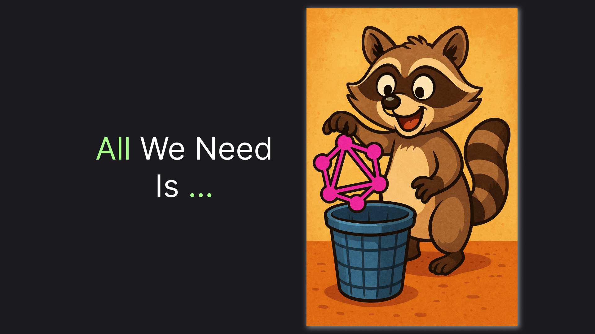

# REST API Solution to Over-Fetching: .NET 9 Example

> Ditch GraphQL, Use This Instead!



GraphQL appeared in 2012 as a new API architecture, allowing you to "give clients the power to ask for exactly what they need and nothing more". It was solving the problem, commonly known as over-fetching, which is considered a weak point of REST architecture.

However, there is a solution to this problem in REST, which is much more elegant, in my view. In this article, we are going to investigate the solution and make a practical example in C#. So, without further ado, let's get started!

> Or jump straight to the [TLDR](#tldr) at the end of this article for a minimized example.

## The Solution: Include Query Parameter

Let's say we have a transactions API. So, as you might expect from a REST API, it is extremely easy to get started and see the list of all the transactions. You just call the `GET /transactions` method. We'll assume we have just 5 records in the system and this is what the endpoint will return: 

```json
{
  "count": 5,
  "items": [
    {
      "id": 1,
      "category": "salary",
      "amount": 100
    },
    {
      "id": 2,
      "category": "salary",
      "amount": 200
    },
    {
      "id": 3,
      "category": "stocks",
      "amount": 300
    },
    {
      "id": 4,
      "category": "food",
      "amount": -100
    },
    {
      "id": 5,
      "category": "stocks",
      "amount": -100
    }
  ]
}
```

Of course, REST is well-known to be good at simple queries. But what if we want to introduce pagination? It is likely we'll need to get a `total` number of rows to show how many pages we have. 

The easiest solution would be to just add the parameter to the response. However, it will mean that we will need to do an additional query on **every** `GET transaction` request. Gladly, there is a solution that is also pretty simple, but is much more flexible: 

> Allow inclusion of additional information via an `include` parameter.

Here's what an example pagination query might look like

```http
GET /transactions?limit=2&include=total
```

And here's what the response will be:

```json
{
  "count": 2,
  "items": [
    {
      "id": 1,
      "category": "salary",
      "amount": 100
    },
    {
      "id": 2,
      "category": "salary",
      "amount": 200
    }
  ],
  "total": 5
}
```

So far so good. But using `include` for the `total` count doesn't fully demonstrate the power of the parameter. The true power is demonstrated best by aggregated queries.

For example, let's say we want to see just the total sum and number of transactions by category, not the transactions themselves. Here's how our request will look 

```http
GET /transactions?limit=0&include=categories.total,categories.totalSum
```

```json
{
  "count": 0,
  "items": [],
  "categories": {
    "salary": {
      "totalSum": 300,
      "total": 2
    },
    "stocks": {
      "totalSum": 200,
      "total": 2
    },
    "food": {
      "totalSum": -100,
      "total": 1
    }
  }
}
```

As you might see in this example, the `include` parameter enables versatile customization of a `GET` endpoint for various use cases. Moreover, it gives control over that customization to the client — something GraphQL brags about.

I hope you find the `include` parameter as powerful as I do. You might be wondering how hard it is to implement the parameter on the server side. Let me show you an example implementation in the next sections.

## Setting Up An Example API

```sh
dotnet add package Microsoft.EntityFrameworkCore.InMemory
dotnet add package Persic.EF
```

```csharp
using Microsoft.EntityFrameworkCore;

public class Transaction
{
    public long Id { get; set; }
    public required string Category { get; set; }
    public required decimal Amount { get; set; }
}

public class Db(DbContextOptions<Db> options) : DbContext(options)  {
    public required DbSet<Transaction> Transactions { get; set; }
}

public static class InMemoryDbRegistration
{
    public static IServiceCollection AddInMemory<TDb>(this IServiceCollection services) where TDb : DbContext
    {
        var inMemoryDbId = Guid.NewGuid();
        services.AddDbContext<TDb>(o => o.UseInMemoryDatabase(inMemoryDbId.ToString()));
        return services;
    }
}
```

```csharp
public record TransactionCollection(
    int Count,
    Transaction[] Items
);

public record TransactionsQuery(
    int? Limit = null
);
```

```csharp
using Microsoft.EntityFrameworkCore;
using Persic;

var builder = WebApplication.CreateBuilder(args);

builder.Logging.AddSimpleConsole(c => c.SingleLine = true);

builder.Services.ConfigureHttpJsonOptions(options => {
    options.SerializerOptions.DefaultIgnoreCondition = JsonIgnoreCondition.WhenWritingNull;
    options.SerializerOptions.DictionaryKeyPolicy = JsonNamingPolicy.CamelCase;
});

builder.Services.AddInMemory<Db>();

var app = builder.Build();

await app.Services.EnsureRecreated<Db>(async db =>
{
    db.Transactions.Add(new() { Category = "salary", Amount = 100 });
    db.Transactions.Add(new() { Category = "salary", Amount = 200 });
    db.Transactions.Add(new() { Category = "stocks", Amount = 300 });
    db.Transactions.Add(new() { Category = "food", Amount = -100 });
    db.Transactions.Add(new() { Category = "stocks", Amount = -100 });

    await db.SaveChangesAsync();
});

app.MapGet("/transactions", async (Db db, [AsParameters] TransactionsQuery query) =>
{
    IQueryable<Transaction> dbQuery = db.Transactions;

    var items = await dbQuery
        .Take(query.Limit ?? int.MaxValue)
        .ToArrayAsync();

    return new TransactionCollection(
        Count: items.Length,
        Items: items
    );
});

app.Run();
```

```http
GET /transactions?limit=2
```

```json
{
  "count": 2,
  "items": [
    {
      "id": 1,
      "category": "salary",
      "amount": 100
    },
    {
      "id": 2,
      "category": "salary",
      "amount": 200
    }
  ]
}
```

## Enabling Pagination: include=total

```csharp
public record TransactionCollection(
    int Count,
    Transaction[] Items,
    int? Total = null
);

public record TransactionsQuery(
    string[]? Include = null,
    int? Limit = null,
    string? Category = null
)
{
    public bool Includes(string value) => Include?.Contains(value) ?? false;
}
```

```csharp
IQueryable<Transaction> dbQuery = db.Transactions
    .Where(x => query.Category == null || x.Category == query.Category);

var items = await dbQuery
    .Take(query.Limit ?? int.MaxValue)
    .ToArrayAsync();

return new TransactionCollection(
    Count: items.Length,
    Items: items,
    Total: query.Includes("total") ? await dbQuery.CountAsync() : null
);
```

```http
GET http://localhost:5058/transactions?limit=0&include=total
```

```json
{
  "count": 0,
  "items": [],
  "total": 5
}
```

```http
GET http://localhost:5058/transactions?limit=1&include=total&category=salary
```

```json
{
  "count": 1,
  "items": [
    {
      "id": 1,
      "category": "salary",
      "amount": 100
    }
  ],
  "total": 2
}
```

## Building Aggregates: include=categories.totalSum

```sh
dotnet add reference Nist.Queries;
```

```csharp
using Nist;

public record IncludeQueryParameter(CommaSeparatedParameters<ObjectPath> Inner) : CommaSeparatedParameters<ObjectPath>(Inner)
{
    public static bool TryParse(string source, out IncludeQueryParameter includeQueryParameter)
    {
        includeQueryParameter = Parse(source);
        return true;
    }

    public static IncludeQueryParameter Parse(string source) => new(
        Parse(source, x => ObjectPath.Parse(x))
    );

    public override string ToString() => base.ToString();
}
```

```csharp
public record TransactionsQuery(
    IncludeQueryParameter? Include = null,
    int? Limit = null,
    string? Category = null
)
{
    public bool Includes(string value) => Include?.Have(value) ?? false;
}
```

```csharp
public record TransactionCollection(
    int Count,
    Transaction[] Items,
    int? Total = null,
    Dictionary<string, TransactionGroup>? Categories = null
);

public record TransactionGroup(
    decimal? TotalSum,
    int? Total,
    Transaction[]? Items = null
);
```

```csharp
public class GroupAggregateDbResult
{
    public required string Key { get; set; }
    public decimal? TotalSum { get; set; }
    public int? Total { get; set; }
}

public static class GroupAggregateExtensions
{
    public static async Task<Dictionary<string, TransactionGroup>> ToTransactionGroup<TKey>(this IQueryable<IGrouping<TKey, Transaction>> query, IEnumerable<ObjectPath> includes)
    {
        var aggregate = await query.Select(cgr => new GroupAggregateDbResult
        {
            Key = cgr.Key!.ToString()!,
            TotalSum = includes.Have("totalSum") ? cgr.Sum(x => x.Amount) : null,
            Total = includes.Have("total") ? cgr.Count() : null
        }).ToArrayAsync();

        return aggregate.ToResponseDictionary();
    }
    
    public static Dictionary<string, TransactionGroup> ToResponseDictionary(this IEnumerable<GroupAggregateDbResult> dbResults)
    {
        return dbResults.ToDictionary(row => row.Key, row => new TransactionGroup (
            row.TotalSum,
            row.Total
        ));
    }
}
```

```csharp
return new TransactionCollection(
    Count: items.Length,
    Items: items,
    Total: query.Includes("total") ? await dbQuery.CountAsync() : null,
    Categories: query.Includes("categories")
        ? await dbQuery.GroupBy(x => x.Category).ToTransactionGroup(query.Include!.GetChildren("categories"))
        : null
);
```

```http
GET /transactions?limit=0&include=categories.total,categories.totalSum
```

```json
{
  "count": 0,
  "items": [],
  "categories": {
    "salary": {
      "totalSum": 300,
      "total": 2
    },
    "stocks": {
      "totalSum": 200,
      "total": 2
    },
    "food": {
      "totalSum": -100,
      "total": 1
    }
  }
}
```

## TLDR;

```http
GET /transactions?limit=2&include=total,categories.total,categories.totalSum
```

```json
{
  "count": 2,
  "items": [
    {
      "id": 1,
      "category": "salary",
      "amount": 100
    },
    {
      "id": 2,
      "category": "salary",
      "amount": 200
    }
  ],
  "total": 5,
  "categories": {
    "salary": {
      "totalSum": 300,
      "total": 2
    },
    "stocks": {
      "totalSum": 200,
      "total": 2
    },
    "food": {
      "totalSum": -100,
      "total": 1
    }
  }
}
```

```csharp
app.MapGet("/transactions", async (Db db, [AsParameters] TransactionsQuery query) =>
{
    IQueryable<Transaction> dbQuery = db.Transactions
        .Where(x => query.Category == null || x.Category == query.Category);

    var items = await dbQuery
        .Take(query.Limit ?? int.MaxValue)
        .ToArrayAsync();

    return new TransactionCollection(
        Count: items.Length,
        Items: items,
        Total: query.Includes("total") ? await dbQuery.CountAsync() : null,
        Categories: query.Includes("categories")
            ? await dbQuery.GroupBy(x => x.Category).ToTransactionGroup(query.Include!.GetChildren("categories"))
            : null
    );
});
```

Check out complete example code [here on GitHub](https://github.com/astorDev/nist/blob/main/queries/include/playground/Program.cs). You can also use the `Nist.Queries.Include` NuGet package from the same project to add various query parameter utils, including `IncludeQueryParameter`, to your app. 

This example, package, and even this article are part of the [NIST project](https://github.com/astorDev/nist). The project contains many HTTP-related tools beyond queries — check it out and don't hesitate to give the repository a star! ⭐

Claps for this article are also highly appreciated! 😉