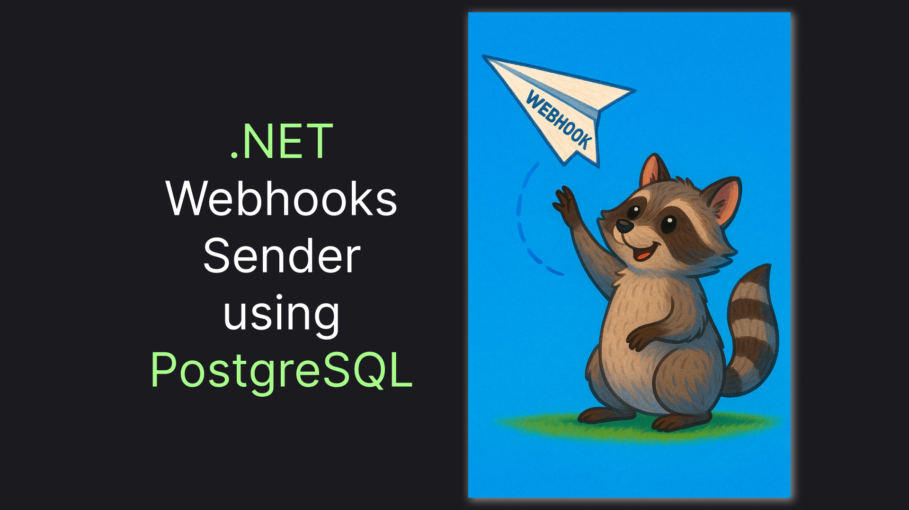

# Webhooks in .NET 9

> Implement a Webhook Sender with .NET and PostgreSQL: A Comprehensive Guide



Webhooks are practically the only option to build an eventually consistent, event-based communication between servers without relying on any shared resource or service. However, .NET does not provide much tooling or guidance on implementing them. This article is another attempt of mine to fix this unfairness. In [the previous article](https://medium.com/@vosarat1995/webhook-testing-in-c-your-own-wiremock-alternative-1439040931c3), I've covered webhook testing. This time, we'll build a solution for a server sending webhooks. Let's get going!

> Or jump straight to the [TLDR;](#tldr) in the end of this article

## Assembling our Webhook Sender

First of all, we need a mechanism to actually send our webhook. We'll use a default web package for assembling it:

```sh
dotnet new web
```

We'll need a set of HTTP-related packages and OneOf just for convenient exception handling. Let's set them up:

```sh
dotnet add package OneOf
dotnet add package System.Net.Http
dotnet add package Microsoft.Extensions.Http
```

Now, let's define a Webhook model, along with a helper method, converting it to an `HttpRequestMessage`. 

> We'll assume JSON body as a de facto standard for modern API communication.

```csharp
public interface IWebhook
{
    long Id { get; }
    string Url { get; }
    JsonDocument Body { get; }
}

public static class IWebhookMapper
{
    public static HttpRequestMessage ToHttpRequestMessage(this IWebhook webhook)
    {
        return new HttpRequestMessage(HttpMethod.Post, webhook.Url)
        {
            Content = new StringContent(webhook.Body.RootElement.GetRawText(), Encoding.UTF8, "application/json")
        };
    }
}
```

Finally, here's our simple `WebhookSender`:

```csharp
public class WebhookSender(HttpClient client, ILogger<WebhookSender> logger)
{
    public async Task<OneOf<HttpResponseMessage, Exception>> Send(IWebhook record)
    {
        try
        {
            logger.LogDebug("Sending webhook {webhookId}", record.Id);

            var request = record.ToHttpRequestMessage();
            var response = await client.SendAsync(request);

            logger.LogInformation("Sent webhook {webhookId}", record.Id);

            return response;
        }
        catch (Exception ex)
        {
            return ex;
        }
    }
}
```

This setup is pretty trivial. Now, we can move to the more complicated part, related to queue processing!

## Making Continuous Webhook Sending Iteration

Beyond sending the webhook, we'll also need to store a webhook queue, with two operations available:

1. Processing Pending Records in a transaction
2. Handling a sending result.

Let's create an interface for that:

> We will make generic implementation with `TRecord` to allow further database model extension. The extension itself is out of the scope of this article, but you can check out how it is used in the [source GitHub repository](https://github.com/astorDev/nist/blob/main/webhooks/send/lib/Repeats.cs).

```csharp
public interface IWebhookStore<TRecord> where TRecord : IWebhook
{
    Task RunTransactionWithPendingRecords(Func<TRecord[], Task> changes, CancellationToken cancellationToken);
    Task HandleResult(TRecord record, OneOf<HttpResponseMessage, Exception> result);
}
```

Webhook sending is basically a continuous iteration of sending pending records and handling the result. In [this article](https://medium.com/@vosarat1995/how-to-implement-a-net-background-service-for-continuous-work-in-2025-6929c496b62f), we've discussed a system allowing us to implement such continuous iteration. We'll use it now to implement a `IContinuousWorkIteration` for our webhook sending.

> Don't forget to install the base package via `dotnet add package Backi.Continuous`.

```csharp
public class WebhookSendingIteration<TRecord>(IWebhookStore<TRecord> store, WebhookSender sender, ILogger<WebhookSendingIteration<TRecord>> logger) 
    : IContinuousWorkIteration where TRecord : IWebhook
{
    public async Task Run(CancellationToken stoppingToken)
    {
        logger.LogInformation("Starting webhook sending iteration");

        await store.RunTransactionWithPendingRecords(async pendingRecords => {
            var processingTasks = pendingRecords.Select(async record => {
                var result = await sender.Send(record);
                await store.HandleResult(record, result);
            });

            await Task.WhenAll(processingTasks);
        }, stoppingToken);

        logger.LogInformation("Webhook sending iteration finished");
        await Task.Delay(TimeSpan.FromSeconds(1), stoppingToken);
    }

    public static async Task OnException(Exception ex, ILogger logger)
    {
        logger.LogError(ex, "Error in webhook sending");
        await Task.Delay(TimeSpan.FromSeconds(5));
    }
}
```

Finally, let's add a helper method for registering webhook sending in a DI container:

```csharp
public static class WebhookSendRegistration
{
    public static IServiceCollection AddWebhookSending<TRecord>(this IServiceCollection services, Func<IServiceProvider, IWebhookStore<TRecord>> storeFactory)
        where TRecord : IWebhook
    {
        services.AddHttpClient();
        services.AddScoped<WebhookSender>();
        services.AddScoped(sp => storeFactory(sp));
        services.AddContinuousBackgroundService<WebhookSendingIteration<TRecord>>();

        return services;
    }
}
```

With the main setup in place, also that is left to do is to actually implement our database layer. Let's move to it in the next section!

## Postgres Webhook Store: Implementing Database Layer

First things first, we'll need to define our entity:

```csharp
public class WebhookRecord : IWebhook
{
    public long Id { get; set; }
    public required string Url { get; set; }
    public required JsonDocument Body { get; set; }
    public string Status { get; set; } = WebhookStatus.Pending;
    public DateTime CreatedAt { get; set; } = DateTime.UtcNow;
    public int? ResponseStatusCode { get; set; }
    public JsonDocument? Response { get; set; }
}

public class WebhookStatus
{
    public const string Pending = "Pending";
    public const string Success = "Success";
    public const string Error = "Error";
}
```

In order to let our queue processing application be scalable, we need to make sure every worker processes only its own set of records in a concurrent scenario. In [this article](https://medium.com/@vosarat1995/postgresql-queue-processing-how-to-handle-concurrency-efficiently-44c3632d3828), we've discussed how to achieve this in Postgres using the `FOR UPDATE` operator. Here's how our query will look:

> Since `FOR UPDATE` locks records for the lifecycle of the database transaction, we'll need to wrap it in a transaction as well. You will see the implementation code in a moment.

```sql
SELECT * 
FROM webhook_records 
WHERE status = {WebhookStatus.Pending}
LIMIT 100
FOR UPDATE SKIP LOCKED
```

Combining the query with a simple result handler, we'll get our store implementation:

```csharp
public class PostgresWebhookStore<TDb>(TDb db, Func<TDb, DbSet<WebhookRecord>> webhookRecordSetExtractor) 
    : IWebhookStore<WebhookRecord> where TDb : DbContext
{
    public async Task RunTransactionWithPendingRecords(Func<WebhookRecord[], Task> processing, CancellationToken cancellationToken = default)
    {
        using var transaction = await db.Database.BeginTransactionAsync(cancellationToken);
        var pendingForUpdate = await webhookRecordSetExtractor(db)
            .FromSqlInterpolated($"""
            SELECT * 
            FROM webhook_records 
            WHERE status = {WebhookStatus.Pending}
            LIMIT 100
            FOR UPDATE SKIP LOCKED
            """)
            .ToArrayAsync();

        await processing(pendingForUpdate);

        await db.SaveChangesAsync(cancellationToken);
        await transaction.CommitAsync(cancellationToken);
    }

    public async Task HandleResult(WebhookRecord record, OneOf<HttpResponseMessage, Exception> result)
    {
        await HandleResultStatic(record, result);
    }

    public static async Task HandleResultStatic(WebhookRecord record, OneOf<HttpResponseMessage, Exception> result)
    {
        if (result.TryPickT0(out var response, out var ex))
        {
            record.Status = response!.IsSuccessStatusCode ? WebhookStatus.Success : WebhookStatus.Error;
            record.ResponseStatusCode = (int)response.StatusCode;
            record.Response = Json.ParseSafely(await response.Content.ReadAsStreamAsync());
        }
        else
        {
            record.Status = WebhookStatus.Error;
            record.ResponseStatusCode = null;
            record.Response = JsonDocument.Parse($"{{\"error\": \"{ex!.Message}\"}}");
        }
    }
}
```

Let's also create a registration helper to simplify our future endeavour:

```csharp
public interface IDbWith<T> where T : class {
    public DbSet<T> WebhookRecords { get; }
}

public static class PostgresWebhookStoreRegistration
{
    public static IServiceCollection AddPostgresWebhookSending<TDb>(this IServiceCollection services, Func<TDb, DbSet<WebhookRecord>> webhookRecordSetExtractor) where TDb : DbContext
    {
        return services.AddWebhookSending(x => {
            var db = x.GetRequiredService<TDb>();
            return new PostgresWebhookStore<TDb>(db, x => webhookRecordSetExtractor(x));
        });
    }

    public static IServiceCollection AddPostgresWebhookSending<TDb>(this IServiceCollection services) where TDb : DbContext, IDbWith<WebhookRecord>
    {
        return services.AddPostgresWebhookSending<TDb>(x => x.WebhookRecords);
    }
}
```

These are all the components we need for a basic webhook sending system. Let's see it in action!

## Testing Our Sender Utilizing Webhook Dump

In order to test the package we can use `webhooks/dump` endpoint, that we've discussed in [the previous webhooks article](https://medium.com/@vosarat1995/webhook-testing-in-c-your-own-wiremock-alternative-1439040931c3). After installing the `Nist.Webhooks.Dump` package we should be able to add it with those two lines of code:

```csharp
app.UseRequestBodyStringReader();
app.MapWebhookDump<Db>();
```

For quick testing, let's initiate our database using the `Persic.EF.Postgres` package. We'll add just one record for testing:

```csharp
await app.Services.EnsureRecreated<Db>(async db => {
    db.WebhookRecords.Add(new WebhookRecord() {
        Url = "http://localhost:5195/webhooks/dump/from-record",
        Body = JsonDocument.Parse("{\"example\": \"one\"}")
    });

    await db.SaveChangesAsync();
});
```

Here's how our `Program.cs` will look in assembly:

```csharp
global using Microsoft.EntityFrameworkCore;
global using Nist;
global using Persic;

var builder = WebApplication.CreateBuilder(args);

builder.Logging.AddSimpleConsole(c => c.SingleLine = true);
        
builder.Services.AddPostgres<Db>();
builder.Services.AddPostgresWebhookSending<Db>();

var app = builder.Build();

await app.Services.EnsureRecreated<Db>(async db => {
    db.WebhookRecords.Add(new WebhookRecord() {
        Url = "http://localhost:5195/webhooks/dump/from-record",
        Body = JsonDocument.Parse("{\"example\": \"one\"}")
    });

    await db.SaveChangesAsync();
});
        
app.UseRequestBodyStringReader();
app.MapWebhookDump<Db>();

app.Run();

public class Db(DbContextOptions<Db> options) : DbContext(options), IDbWith<RepeatableWebhookRecord>, IDbWithWebhookDump {
    public DbSet<RepeatableWebhookRecord> WebhookRecords { get; set; }
    public DbSet<WebhookDump> WebhookDumps { get; set; }

    protected override void OnConfiguring(DbContextOptionsBuilder optionsBuilder)
    {
        base.OnConfiguring(optionsBuilder);
    }
}
```

With that in place, running `dotnet run` and `GET /webhooks/dump` should give us the result looking like the one below:

```json
[
  {
    "id": 1,
    "path": "/webhooks/dump/from-record",
    "body": {
      "example": "one"
    },
    "time": "2025-04-30T14:11:49.607198Z"
  }
]
```

This is the last part of the article. Let's do a quick recap and call it a day!

## TLDR;

In this article, we've built and tested a background service for sending webhooks, based on a PostgreSQL queue. Instead of recreating it from scratch, you can use the `Nist.Webhooks.Sender` package:

```sh
dotnet add package Nist.Webhooks.Sender
```

With the package in place, we could add continuous webhook sending to our app in just a few lines of code:

> For the simple EF Core PostgreSQL setup, I use the  `Persic.EF.Postgres` package. Check out [the dedicated article](https://medium.com/@vosarat1995/integrating-postgresql-with-net-9-using-ef-core-a-step-by-step-guide-a773768777f2) for details!

```csharp
builder.Services.AddPostgres<Db>();
builder.Services.AddContinuousWebhookSending(sp => sp.GetRequiredService<Db>());

// ...

public class Db(DbContextOptions<Db> options) : DbContext(options), IDbWithWebhookRecord<WebhookRecord> {
    public DbSet<WebhookRecord> WebhookRecords { get; set; }
}
```

You can find the code to check the setup in the previous section. You can also check a playground project [straight on GitHub](https://github.com/astorDev/nist/tree/main/webhooks/send/playground). The playground, the package, and even this article are parts of the [NIST project](https://github.com/astorDev/nist). The project's purpose in a few words is to be a Non-Toxic REST alternative, so there's many interesting stuff beyond webhooks - check it out and don't hesitate to give it a star! ⭐

Claps for this article are also highly appreciated! 😉
