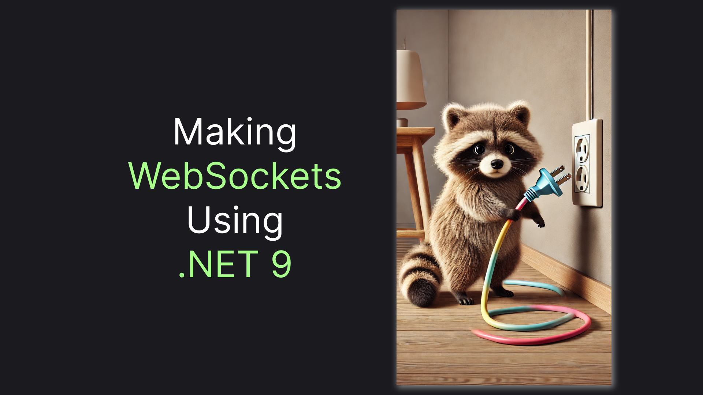
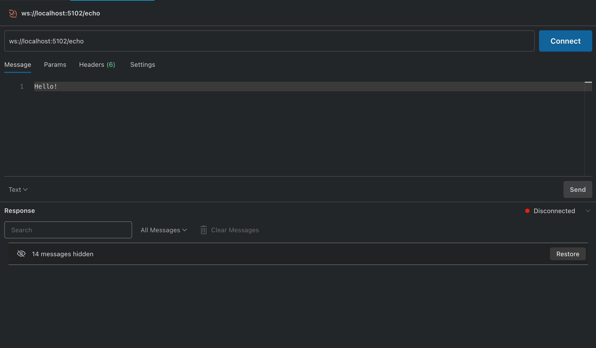
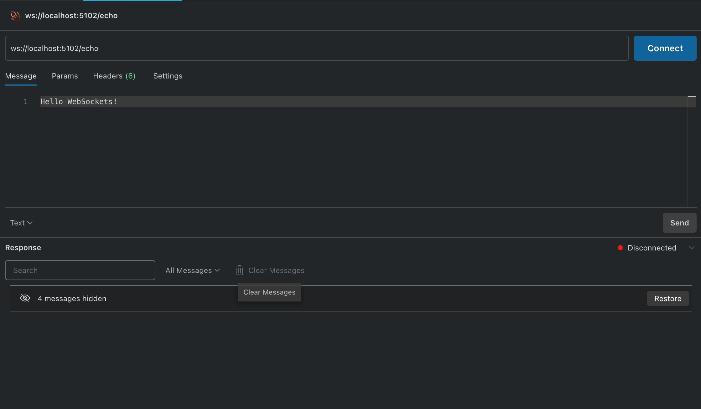
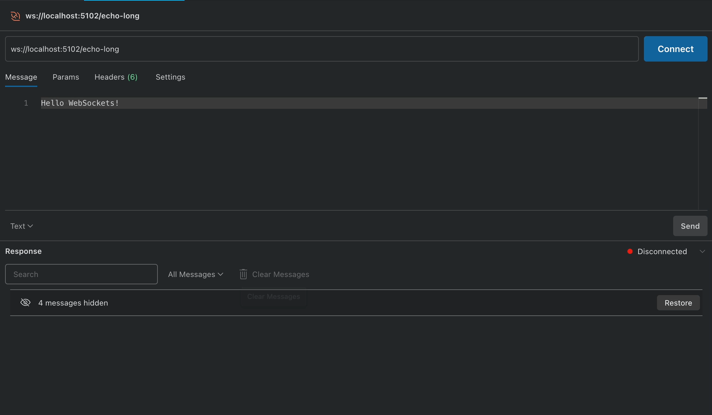
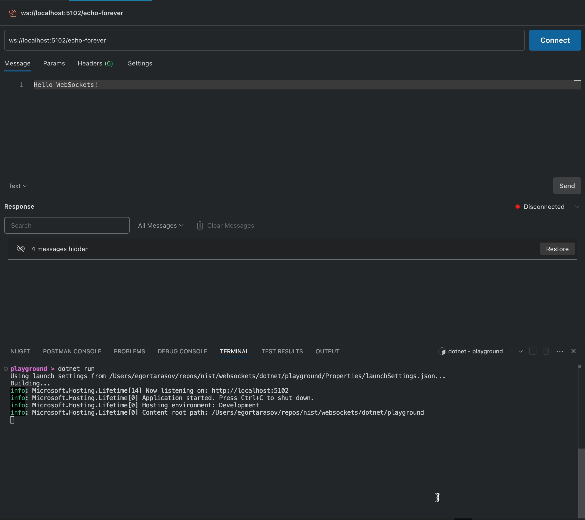
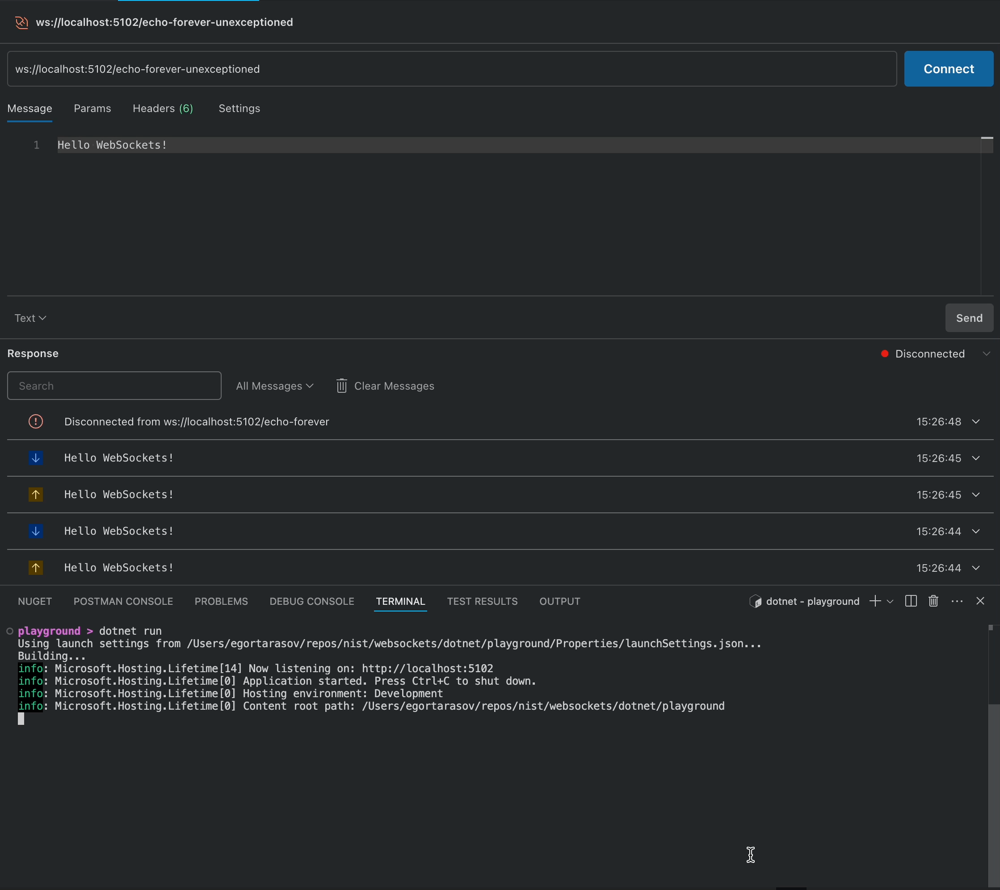
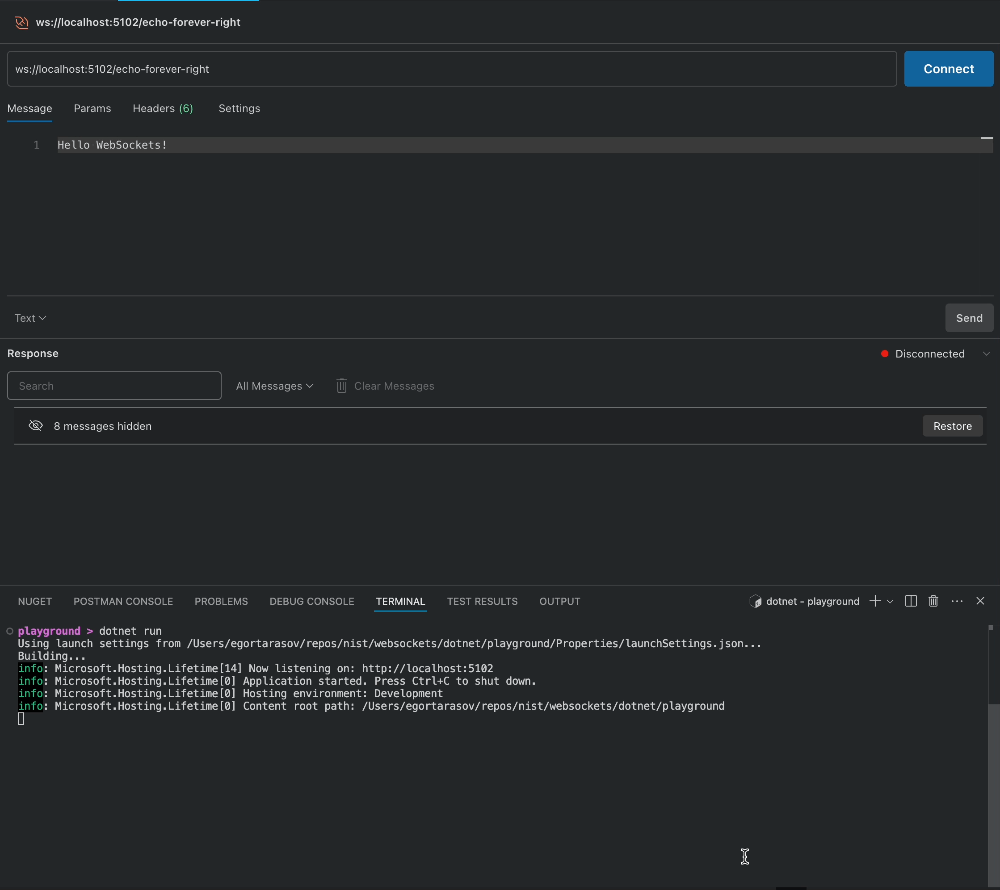

# WebSockets in .NET 9: A Getting Started Guide

> Learn how to implement WebSocket server endpoints using C# with ASP .NET Core 9 Minimal API.



WebSockets are the simplest way to provide real-time communication between front-end and back-end apps. And it's surely possible to use `ASP .NET Core` for that communication style. However, Microsoft's documentation for that technology seems poor and almost abandoned. In this article, I will try to fill the gap, giving you the jump start with WebSockets using the latest `.NET` stack.

> Or jump straight to the end for the [TLDR](#the-final-version)

## The Naive Approach: One-Time Echo

Let's try by creating a project, to run our experiments on. We'll use the default `web` template:

```sh
dotnet new web --name Playground.WebSockets
```

WebSockets are not enabled by default. Gladly, to enable them we just need to add a single line:

```csharp
app.UseWebSockets();
```

To implement a WebSocket endpoint we'll need to extract the `webSocket` from the `HttpContext`,  receive bytes from it, and just send the same bytes back. Here's what our first naive implementation might look like:

```csharp
app.Map("/echo", async (HttpContext context) => {
    var webSocket = await context.WebSockets.AcceptWebSocketAsync();

    var buffer = new byte[8];

    await webSocket.ReceiveAsync(buffer, CancellationToken.None);

    await webSocket.SendAsync(
        buffer, 
        WebSocketMessageType.Text, 
        endOfMessage: true, 
        CancellationToken.None
    );
});
```

And here's how we can use the newly created endpoint:



Hooray, we made a WebSockets endpoint using `.NET`! Of course for now our endpoint has a bunch of problems. Let's address them one by one.

## Improving The Echo: Reading the Whole Message

First, let's try sending a longer message to the endpoint:



As you may see, the endpoint returns just the first part of the message. WebSockets split messages into frames and a single WebSocket message can be fragmented into multiple frames. When we call `ReceiveAsync` we receive the frame, based on the length of `buffer` we supply. Gladly, `WebSocketReceiveResult` identifies whether the frame indicates the end of the message. So we need to `ReceiveAsync` to a joined buffer, while we don't reach the end of the message. Here's the code for an extension method that implements this:


```csharp
public static class WebSocketExtensions
{
    public static async Task<byte[]> ReceiveToTheEndAsync(this WebSocket webSocket, CancellationToken? cancellationToken = null)
    {
        var buffer = new byte[8];
        using var memoryStream = new MemoryStream();
        WebSocketReceiveResult result;

        do
        {
            result = await webSocket.ReceiveAsync(buffer, cancellationToken ?? CancellationToken.None);
            memoryStream.Write(buffer, 0, result.Count);
        } while (!result.EndOfMessage);

        return memoryStream.ToArray();
    }
}
```

> Of course, in a real application we will use a longer byte array length, and the `Hello WebSockets!` will fit the size. However, in a real application, the message could be significantly longer, so we will still need a way to make sure we have read the message till the end.

Let's also wrap `SendAsync` in a shorter method to simplify our code a little further:

```csharp
public static async Task SendFullTextAsync(this WebSocket webSocket, ArraySegment<byte> buffer, CancellationToken? cancellationToken = null)
{
    await webSocket.SendAsync(
        buffer,
        WebSocketMessageType.Text,
        endOfMessage: true,
        cancellationToken ?? CancellationToken.None
    );
}
```

With these methods in hand, let's create a new shorter version of our echo endpoint:

```csharp
app.Map("/echo-long", async (HttpContext context) => {
    var webSocket = await context.WebSockets.AcceptWebSocketAsync();
    var buffer = await webSocket.ReceiveToTheEndAsync();
    await webSocket.SendFullTextAsync(buffer);
});
```

And let's test the new method with our previous "long" message:



One Problem solved! A few more to go!

## Echoing Forever: Keeping the WebSocket

As you may notice, after we send the echo we interrupt our WebSocket connection. Of course, this is not acceptable since it violates the whole purpose of using WebSockets. Don't worry, we'll fix it right now!

The simplest way to keep the connection is to loop `while` there's no cancellation requested from the `CancellationToken`. Like this:

```csharp
app.Map("/echo-forever", async (HttpContext context, CancellationToken cancellationToken) => {
    var webSocket = await context.WebSockets.AcceptWebSocketAsync();

    while (!cancellationToken.IsCancellationRequested)
    {
        var buffer = await webSocket.ReceiveToTheEndAsync();
        await webSocket.SendFullTextAsync(buffer);    
    }
});
```

Let's test what we get now:



Great, now we can echo for however long we wish! But see the exception popping in the logs? Let's handle it!

## The Almost Perfect Echo: Sending The Close Frame

If we study the exception just for a little we will find that it happens because we try to receive our next frame, despite the WebSocket not being open anymore. This is an easy fix! We just need to check that `webSocket.State == WebSocketState.Open` before running a new cycle of message receiving. With the fix and a few logging added for transparency, we can get a code like this:

```csharp
app.Map("/echo-forever-unexceptioned", async (HttpContext context, CancellationToken cancellationToken) => {
    var webSocket = await context.WebSockets.AcceptWebSocketAsync();

    while (!cancellationToken.IsCancellationRequested && webSocket.State == WebSocketState.Open)
    {
        var buffer = await webSocket.ReceiveToTheEndAsync(cancellationToken);
        app.Logger.LogInformation("Received: {buffer}", Encoding.UTF8.GetString(buffer));
        await webSocket.SendFullTextAsync(buffer, cancellationToken);
    }

    app.Logger.LogInformation("WebSocket closed");
});
```

Let's test this now:



We stopped receiving the exception! But, as you might see, Postman shows a warning sign next to the closing message. This is because proper closing of WebSockets connection implies receiving `Close` confirmation from the party opposite to the closing initiation - in this case, our server. Well, we just need to send the `WebSocketCloseStatus.NormalClosure` from our server after receiving a closing request from the client. Like this:

```csharp
if (webSocket.State == WebSocketState.CloseReceived)
{
    await webSocket.CloseAsync(WebSocketCloseStatus.NormalClosure, "Closed", CancellationToken.None);
}
```

Let's test it again:



Finally, our endpoint functions properly. Now, there's just one thing left to do!

## The Final Version

At the beginning of the article, we wrote a helper extension method for WebSockets. That's a shame we would have to write such low-level methods ourselves. Gladly, there's a dedicated nuget package containing similar extension methods. Let's install it:

```sh
dotnet add package Nist.WebSockets
```

Now, let's write the final version of our echo endpoint, utilizing the package:

```csharp
using Nist;

// ...

app.Map("/echo-forever-final", async (HttpContext context, CancellationToken cancellationToken) => {
    var webSocket = await context.WebSockets.AcceptWebSocketAsync();

    while (!cancellationToken.IsCancellationRequested && webSocket.State == WebSocketState.Open)
    {
        var buffer = await webSocket.ReceiveAsync(cancellationToken: cancellationToken);
        app.Logger.LogInformation("Received: {buffer}", Encoding.UTF8.GetString(buffer));
        await webSocket.SendAsync(buffer, cancellationToken: cancellationToken);
    }

    if (webSocket.State == WebSocketState.CloseReceived)
    {
        await webSocket.CloseAsync(WebSocketCloseStatus.NormalClosure, "Closed", CancellationToken.None);
    }

    app.Logger.LogInformation("WebSocket closed");
});
```

Now, let's do the final test!


With the help of the package, we will need way less code to write a properly functioning WebSockets endpoint! The package is part of the [Nist](https://github.com/astorDev/nist) project, providing tools for **Ni**ce **S**tate **T**ransfer. In the repository, you can find the [article source code](https://github.com/astorDev/nist/tree/main/websockets/dotnet/playground) as well as the [package source code](https://github.com/astorDev/nist/tree/main/websockets/dotnet/lib). Give it a Star on the [Github](https://github.com/astorDev/nist)! And also ... claps for the article are appreciated 👉👈
